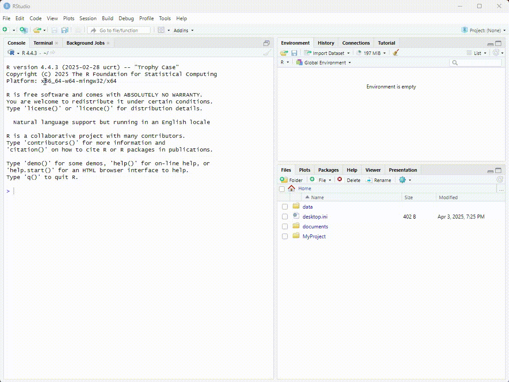
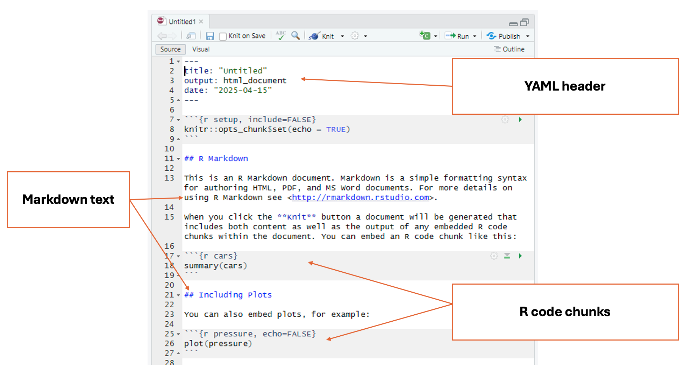

```{r setup, include=FALSE}
knitr::opts_chunk$set(message = FALSE, warnings = FALSE)
```

## Introduction

<h4 style="text-align:center;"><strong>RStudio is a program that helps you write and run R code more easily, especially for working with data, making graphs, and doing statistics.</strong></h4>

In this tutorial, we will:

- Get familiarized with the RStudio interface
- Learn how to set the working directory
- Understand the types of documents we can create in R Studio
- Create an R Markdown file to start our project

## RStudio Interface

When we launch RStudio for the first time, we notice three main panels or quadrants: 


Once we open a document, the interface will show four main panels:


### 1 - Top left panel
#### Files and scripts (source window or code editor)

This is your code editor, where you write, save, and run R scripts (.R), RMarkdown documents (.Rmd), or other file types.

### 2 - Bottom left panel
#### R console and terminal

This is the interactive R console, where code is executed immediately. You can:

 - Type and run commands interactively (great for testing small bits of code).
 - View outputs, error messages, and warnings in real time.
 - Switch to the Terminal tab for system-level commands.

### 3 - Top right panel
#### Objects, history, environment, tutorial and connections

This area lets you track what’s happening in your R session.

It has different tabs for different actions: 

 - **Environment:** See all objects (like data frames, functions, variables) currently in memory.
 - **History:** View all commands you’ve previously run.
 - **Connections:** Manage database connections.
 - **Tutorial:** View built-in interactive tutorials (from the learnr package).

### 4 - Bottom right panel
#### Tree of folders, plots, packages, help, viewer

This panel contains various tools and outputs:

 - **Files:** Navigate your folder structure and open scripts.
 - **Plots:** View visualizations generated by your code.
 - **Packages:** Install, load, or update R packages.
 - **Help:** Search R documentation (?function_name shows here).
 - **Viewer:** View HTML content, like R Markdown outputs or Shiny apps.

## R Projects 

### File paths
We use file paths to indicate the exact location of a file in our computer. There are two main types of file paths: absolute and relative.

#### Absolute paths 
Absolute paths have the full address to a file or folder and are specific to operating systems:

````markdown
`r ''`Example (Windows): C:\Users\Name\Documents\Research\data.csv
Example (Mac): /Users/Name/Documents/Research/data.csv

Note: Windows uses \, MacOS uses /
````

 

#### Relative paths 
Relative paths have the location of a file relative to the current directory or the directory where your R script is located (if you're using R).
 
 - It’s portable, meaning you can share it with others as long as they have the same file structure.
 
 
 ````markdown
`r '' `Example (if you're in the Documents folder): Research/data.csv
````

This means "look for the file *data.csv* inside the *Research folder*, which is in the same folder as the current working directory."

### Setting working directory

Most R tutorials and books teach the function `setwd()` for setting the working directory. This function manually sets the working directory during an R session. It tells R where to look for files and where to save outputs just for that session.

But here’s the problem...

Using `setwd()` can break your code when:

 - Someone else tries to run it on their machine.
 - You move your project folder.
 - You're running your code on a server or in cloud environments like RStudio Cloud.

Since file paths are hardcoded and depend on your machine, **it's not reproducible**.

### Create an R Project

An R Project is a feature in RStudio (and supported in base R too) that provides a self-contained working environment. When you create an R Project it creates a .Rproj file in a folder and that folder becomes the root directory of your project. Every time you open the project (via the .Rproj file), R automatically sets the working directory to that folder. You can reference files relative to the project root — no need to hardcode file paths.

This is super useful when you're working on multiple analyses, sharing code with collaborators, or version-controlling with Git. **It is a good practice for reproducible research**

To create an R Project, select File > New Project


## Types of files in R

There are two main types of files we can create in R studio to edit our code (Base R files `.R` and RMarkdown files `.Rmd`)

The base R file (`.R`) is a plain text file that contains R code only. Use it when you want to write and run code line-by-line, such as for data cleaning, analysis, or function building. It's good for experimenting, scripting, and running code interactively. It's also good for sharing code with other researchers.

The RMarkdown file (`.Rmd`) has a mix of R code and written explanations, using Markdown formatting. Can be used to create dynamic, reproducible reports that can be knitted into HTML, PDF, or Word documents.It's great for homework, research reports, dashboards, or combining narrative with code.

To create an RMarkdown file, select File > New File > RMarkdown



## Markdown
Markdown is a simple way to format text using plain symbols and characters, without needing complex tools. It was designed to make writing easy and readable. Many websites, blogs, and online platforms use Markdown because it is quick to write and easy to convert into nice-looking documents. Learning Markdown gives you a foundation for organizing your ideas clearly, and it’s the basic language that RMarkdown builds on to create reports that combine text, code, and results all in one document.

## RMarkdown
With RMarkdown, you can write plain text like in Markdown — but you can also insert chunks of R code that run directly inside the document. This means you can create reports that mix text, analysis, tables, and graphs all in one place. RMarkdown automatically runs the code, captures the results, and formats everything into a polished document like a PDF, Word file, or website.

The key difference between the RScript files and RMarkdown files is that RScript is used for executing code and performing computations, whereas RMarkdown is a tool for combining R code with explanatory text in a structured document. In RMarkdown, code chunks can be embedded within a narrative, and when the document is **knit** the results (including text, tables, and plots) are automatically generated and formatted, making it ideal for creating research reports, analyses, and presentations.

RMarkdown offers formatting options that help us organize the file into sections, it is a good practice to document every step taken when working with data. 

## RMarkdown structure

RMarkdown documents have three main parts:

 - **YAML header** 
 - **Markdown text** 
 - **R code chunks** 
 
 

### YAML header
This is the section at the very top of the document (enclosed by --- lines). It holds metadata about your document—like the title, author, date, and output format (HTML, PDF, Word, etc.).

### RMarkdown text
This is the regular explanatory text in the document. You can use simple formatting: **bold**, *italics*, lists, headers, links, etc.

**Symbol** |**Description**
|:------|:------|
| #| Level 1 heading|
| ##| Level 2 heading|
| ###| Level 3 heading|
| * word * (without spaces)| *Italics*| 
| ** word ** (without spaces)| **Bold**|


### R Code Chunks
These are sections of code surrounded by triple backticks and {r}.This is where you write the actual R code that runs analyses, creates plots, loads data, etc. Inside a chunk of R code, everything behaves the same as a regular R document.

````markdown
`r ''````{r}

```
````

For additional information, visit the [RMarkdown lesson from RStudio](https://rmarkdown.rstudio.com/lesson-8.html), and the [RMarkdown definitive guide](https://bookdown.org/yihui/rmarkdown/) 

## Your Turn! 

:::question
Create your first RProject. We will name this project `js_timeuse_2025`
:::

:::question
Create your first RMarkdown file. We will name this file `script_js_timeuse_2025`
:::

:::question
In your RMarkdown file, add the following:
:::

  1. Level 1 heading "Learning RDM with Time Use Project"
  2. Brief description of the project: 
  3. Level 2 heading "My first chunk of code"
  4. Insert an empty chunk of code
  5. Inside the chunk of code, type the following: `5+3` (Yes! R can be used as a simple calculator too!)
  6. Click the play button on the top right corner of the code chunk. This will display the result of the code chunk. 
 
 Finally, lets save and visualize our work.
 
:::question

-Click on the save button in the top left panel. Make sure you are in the correct folder. Save the file as '`script_js_timeuse_2025.Rmd`

-Click the knit icon at the top of your code editor to preview your formatted file in .html
:::

We will continue adding information to this RMarkdown file later today and the rest of the week.


