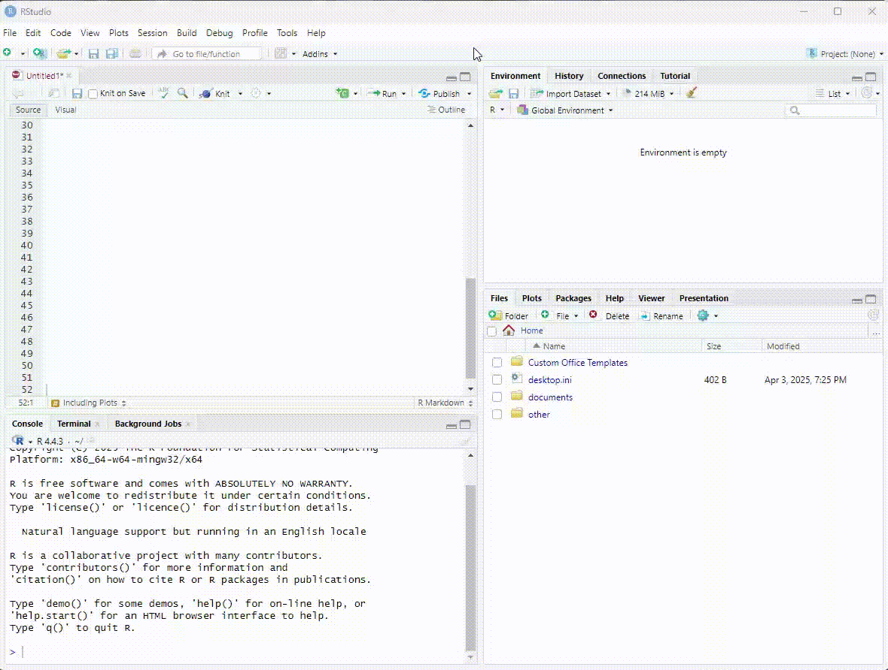

```{r setup, include=FALSE}
knitr::opts_chunk$set(message = FALSE, warnings = FALSE)
```

## Introduction

:::note
R Markdown lets you combine R code and text in one document to create dynamic, reproducible reports.
:::

By embedding code directly within your written explanations, R Markdown ensures that your analysis, results, and visuals are automatically updated if the data or code changes—making it easy for others (and your future self!) to understand, verify, and rerun your work exactly as it was done.

In this short tutorial, we will learn:

- How to use R code within an R Markdown document
- How to import and explore our dataset
- How to recode column names 


## Intro to Data in R

### Basic Syntax of R 

The most important components of an R script are **objects** and **functions**. Objects store information and functions are used to manipulate the data. 

**Assignment operators**, **pipes** and **arguments** are used to link objects and functions and communicate what we want to do.


#### Objects
An object is anything you create and name in R. It can be a number, a dataset, a function, or even a plot. Objects take on content from everything to the right of the assignment operator.

```{r}
x <- 5 #x is now an object that holds the value 5
b <- "Anna" #b is now an object that holds the character Anna
```
**Note:** since Anna is a character, it needs to be wrapped in quotations (We will learn more about data types tomorrow).

#### Functions
Functions are a set of instructions that accomplish a task. They are often (though not always) instructions to be performed on an argument. Functions do something—like calculate, sort, or plot. You call them by their name and add parentheses.

#### Arguments
Arguments are the details you give a function so it knows what to do. They go inside the parentheses of a function. 

```{r}
mean(c(1, 2, 3)) #this calls the mean function to calculate the average of those numbers
```

#### Assignment Operators
This is how you store a value in R. It’s like saying: “Let this name hold this value.” It assigns content from the objects/functions/arguments on its right to the object on its left.

```{r}
name <- "Maria" #Now name holds the string "Alex".
```

The arrow <- is the most common, but = can also be used in some contexts.

#### Pipes
This is used to chain steps together in a readable way. Instead of nesting functions, you move step-by-step like a recipe.

```{r}
mynumbers <- (c(1,2,3)) #storing the numbers 1, 2 and 3 in the object called "mynumbers"
mynumbers |> mean() #take the object mynumbers and pipe it into the mean function
```


## Packages and Libraries

Collections of R functions are stored in Packages. In order to use a specific function we need to install the package that contains that function.

### Tidyverse

When we talk about "Base R" we refer to the original functions and syntax included with R—no extra packages needed. Base R contains many functions like `read.csv()`, `mean()`, `subset()`, and `plot()`. It can be very powerful and flexible but sometimes it is less intuitive for beginners.

We will install **Tidyverse**, which is a colection of packages designed to make data analysis easier and more consistent.

Think of the tidyverse as a toolbox that gives you simple and readable functions for the most common steps in working with data:

 - Importing data (e.g., readr, readxl)
 - Cleaning and transforming data (e.g., dplyr, tidyr)
 - Visualizing data (e.g., ggplot2)
 - Working with strings (e.g., stringr) or dates (e.g., lubridate)

All these packages follow the same logic and syntax, so once you learn one, the others feel familiar too.
For additional information, [click here](https://www.tidyverse.org/)

We will be using packages from Tidyverse later today and tomorrow...

### Install Package
To install a package we use the function `install.packages()`. 

```{r}
#install.packages("tidyverse")
```

### Load Libraries
Packages are stored in libraries. Once a package is installed, we need to call the library with the function `library()`.

```{r}
library(tidyverse)
```

:::flag
Note that the package name needs to be in quotations when installing the package, but not when loading the library.

Packages only need to be installed once.

Libraries need to be loaded in each work session.
:::


Remember the Tidyverse Data Science Workflow? Today we will be focusing on the first two steps:


[Source](https://telapps.london.edu/analytics_with_R/tidyverse.html)

## Read Data

### Read a csv file
To import a csv file we can use the `read_csv()` function and assign it to a new object we will call *data*. We create a new object to be able to call it in different functions later on.
```{r}
data <- read_csv("data/timeuse_day1_na.csv")
```

### Read Other Formats
In the example we are working with the data is stored in a csv file. The package **readr** from Tidyverse can also read other formats like `read_tsv()`(tab-separated values), `read_delim()`(delimited files CSV and TSV), `read_table()`(whitespace-separated files), `read_log()`(web log files).

There are other functions and packages that allow us to import different file types. 

**File Type** |**Function** | **Package**
|:------|:------|:-------|
|.csv | `read_csv()`| readr |
| .xlsx | `read.xlsx()`| xlsx |
| .sav | `read_sav()`| haven |
| .sas7bdat , .sas7bcat | `read_sas()`| haven |
| .dta | `read_dta()`| haven |

### From environment tab
It is also possible to import a dataset from the Environment tab in the top right panel. In this case, the code will appear in the Console (bottom left panel). Remember to transfer this line of code to your RMarkdown document.



## Listing Column Names
To ask for a list of all the column names in our dataset we can use the `names()` function.
```{r}
names(data)
```

Notice that the column names from the original dataset don't provide a clear description of what the variable is. We will change the column names later to facilitate working with our data in the future.

## Head Function
The head function will display the top rows of the dataset. It will include information about the default data type assigned to each column. You will learn more about data types tomorrow.

```{r, data-isolation, results = 'hide'}
head(data)
```

```{r, echo = FALSE}
library(kableExtra)
head(data) |>
  kbl() |>
  kable_styling(bootstrap_options = "striped")
```

## Viewing Data
To visualize the full dataset we use the `View()` function. This will open our dataset in a separate window.
```{r}
View(data)
```


## Change Column Names
We mentioned earlier that we wanted to work with column names that were more descriptive of the content of each variable. To change column names we can use the function `rename()`.

The function `rename()` is part of the dplyr package that was installed with tidyverse.

:::walkthrough
Type the following code to change the column name from "PUMFID" to "id"
```{r}
data <- data |>
  rename ("id" = "PUMFID")
```
Did it work?
:::

## Your Turn!

:::question
Now, to change the rest of the column names copy the following code. (click show to see the code)

```{r, class.source = 'fold-hide'}
data <- data |>
  rename ("ageGrp" = "AGEGR10",
          "sex" = "SEX",
          "maritalStat" = "MARSTAT",
          "province" =  "PRV",
          "popCenter" = "LUC_RST",
          "eduLevel" = "EHG_ALL",
          "feelRushed" = "GTU_110",
          "extraTime" = "GTU_130",
          "durSleep" = "DUR01",
          "durMealPrep" = "DUR05",
          "durEating" = "DUR06",
          "durAlone" = "DURS200",
          "durDriving" = "DURL313",
          "durWork" = "DUR08",
          "durShoolSite" = "DUR13",
          "durSchoolOnline" = "DUR14",
          "durStudy" = "DUR15",
          "worked12m" = "MRW_D40A",
          "workedWeek" = "MRW_D40B",
          "enrollStat" = "EDM_02",
          "dailyTexts" = "TST_01",
          "timeSlowDown" = "TCS_110",
          "timeWorkaholic" = "TCS_120",
          "timeNotFamFriends" = "TCS_150",
          "timeWantAlone" = "TCS_200")
```

:::

:::question
Use the function`names(data)` to display the column names.
```{r}
names(data)
```
:::


## Save your work
Saving in R format (RData) will preserve data types and metadata assigned to the dataset. 
The text format (csv) will be the ideal format to share the data.

```{r}
save(data, file="data/timeuse_day2.RData")
```

```{r}
save(data, file="data/timeuse_day2.csv")
```

## Upload to OSF
At the end of each work session, remember to save your data as .RData and .csv, and also your RMarkdown file (.Rmd). We will upload those files to OSF.

#note: pending, add how to deposit in OSF

