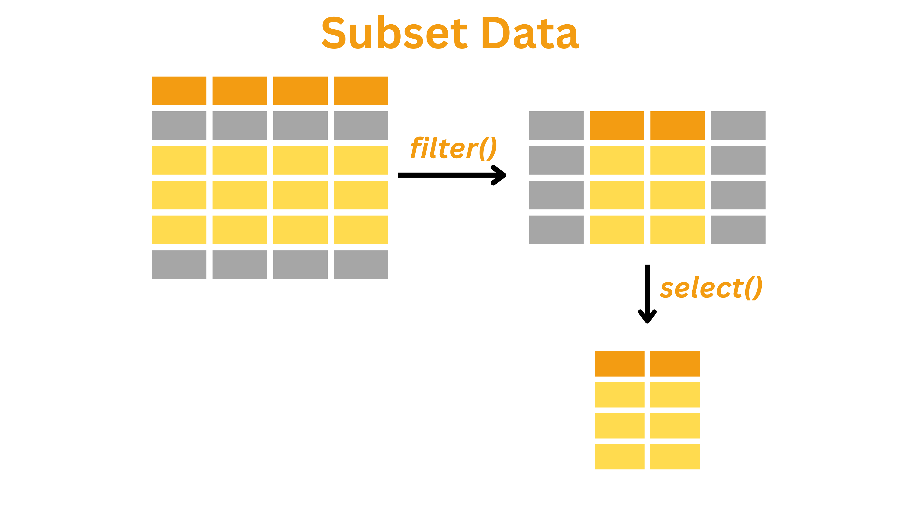
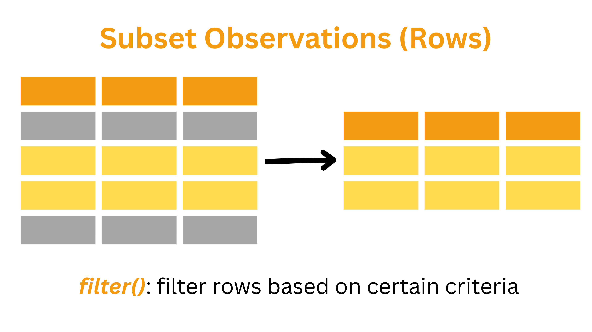
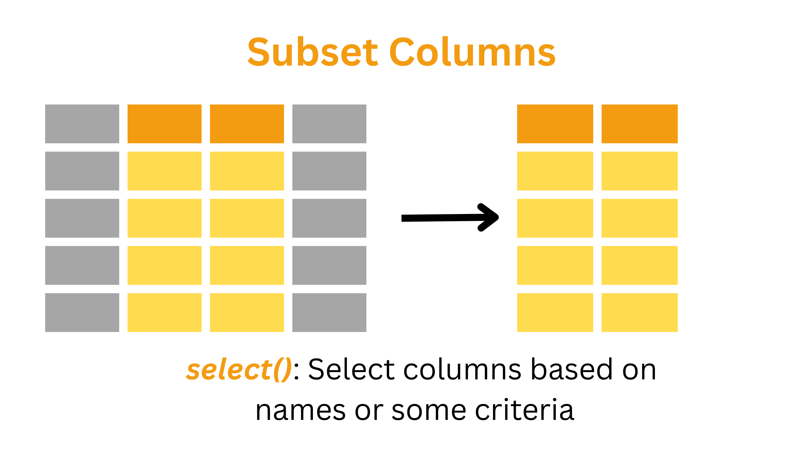

## Overview

---




### Introduction

<h4 style="text-align:left;"><strong>Subsetting data is an essential part of the <em>tidy</em> stage in the data science workflow. It involves extracting a portion of the dataset based on specific conditions.</strong></h4>

In this short tutorial, we will learn:

1. Why subsetting is crucial and what subsetting means
2. How to perform subsetting using conditional operators and the dplyr functions `filter()` and `select()`

---

### Why subsetting dataset is important?

:::note
  Most real-world datasets are large and complex, with many variables and thousands of records.
:::

Most real-world datasets are large and complex, with many variables and thousands of records. Analyzing all of it at once can introduce noise, slow down computation, and make it harder to detect meaningful patterns. By filtering rows and selecting specific columns, you reduce this complexity, improve clarity, and can more efficiently test hypotheses or build models. Subsetting also plays a key role in ensuring data quality, allowing you to remove irrelevant or problematic entries like missing values, outliers, or categories outside the scope of your analysis.

:::note
  Filtering rows and selecting specific columns helps you:

  - Reduce dataset complexity and improve clarity, making it easier to test hypotheses efficiently
  - Remove irrelevant or problematic entries such as missing values, outliers, or unused categories, improving overall data quality
:::


:::flag
The original dataset is very large—it includes 848 variables and 17,000+ observations.
:::

The dataset we have used in previous sessions originated from the General Social Survey, Cycle 29 (2015), from the Social and Aboriginal Statistics Division at Statistics Canada. This survey tracks how Canadians spend and manage their time, helping us understand patterns tied to well-being and stress. However, the original dataset is very large—it includes over 848 variables and more than 17,000 observations. 

For the purposes of this tutorial, we are not interested in every variable. Instead, we work with a **subset** of this dataset: 29 variables focused mainly on time durations and key demographic characteristics. This makes the data more manageable and relevant for our exploration of time use and perceptions of time pressure.

---

### Framing the Guiding Question: Who Feels Rushed?

Let's return to the time usage dataset. In this section, suppose we're interested in understanding how people who feel rushed spend their time differently from those who don't. To answer this question, we don't need every single row or column, as working with the data in its original format would be unnecessarily complex. Instead, we need to "get inside" our data by subsetting: filtering the rows and selecting the columns that matter.

We will explore our dataset through one guiding question:

**How do people who feel rushed spend their time differently from those who don't?**

We'll focus on relevant rows and columns that answer this question.

---

## Step 0: Setup and Load Data

---


### Load and Understand Dataset 

First, we need to load the necessary libraries for today.

```{r, data-isolation-15, results = 'hide', echo=FALSE}
library(kableExtra)
```

```{r, libraries}
library(dplyr)
```

In our subsequent tasks, the `dplyr` package will be essential for subsetting operations like filtering rows and selecting columns. 

Now, let's load our time usage dataset that we prepared in the previous part. We'll use the `.Rdata` file format, which is a convenient way to save and load R objects. This file contains the cleaned and processed dataset that we'll be working with for our subsetting operations.

```{r}
# Load the .Rdata file
file_path <- "data/timeuse_day3_1.Rdata"
load(file_path)

# Check what objects were loaded
ls()
```

This code loads our saved data file into R using the `load()` function. Then it uses `ls()` to list all objects in our environment, which helps us confirm that our data was successfully loaded before we begin our analysis.

Now, let's examine our dataset structure by displaying the first few rows by using `head()` function.

```{r, data-isolation-1, results = 'hide'}
head(data)
```

```{r, echo=FALSE}
# View the first few rows of the dataset
head(data) |>
  kbl() |>
  kable_styling(bootstrap_options = "striped") |>
  scroll_box(width = "100%")
```


As we can see, there are 30 columns in the dataset, which is a lot to work with. For now, we can focus on the following key columns:

- `id`: Record identification
- `ageGrp`: Age group of respondent (groups of 10)
- `sex`: Sex of respondent
- `maritalStat`: Marital status of the respondent
- `province`: Province of residence
- `popCenter`: Population centre indicator
- `eduLevel`: Educational attainment (highest degree)
- `feelRushed`: General time use – Feel rushed
- `extraTime`: General time use – Extra time
- `durSleep`: Duration – Sleeping, resting, relaxing, sick in bed
- `durWork`: Duration – Paid work
- `timeWorkaholic`: Perceptions of time – Workaholic
- `timeWantAlone`: Perceptions of time – Would like more time alone

These columns provide information on demographics, time usage, and time perceptions. We can use them to explore patterns in work–life balance, education, and social time.

Now that we understand our dataset structure, let's move on to learning how to filter and manipulate this data effectively using Boolean operators in `dplyr`.

---

## Step 1: Learn About Filtering

---

### Conditional Filtering with Boolean Operators using **dplyr**

`dplyr` is a powerful package that lets us extract and transform data with a clear, readable syntax. In `dplyr`, we use functions like `filter()`, `select()`, and `mutate()` to work with our data. Boolean operators (`==`, `<`, `>`, `<=`, `>=`, and `!=`) are used within these functions to test conditions, and we can combine conditions with `&` (and) or `|` (or).

Let's start by understanding the basic comparison operators that will help us create filtering conditions.

#### **Comparison Operators**

Comparison operators allow us to check conditions within our dataset. These return `TRUE` or `FALSE` based on whether the condition is met.

| Operator | Meaning                  | Example  | Result |
|----------|--------------------------|----------|--------|
| `==`     | Equal to                 | `5 == 5` | `TRUE` |
| `!=`     | Not equal to             | `5 != 3` | `TRUE` |
| `<`      | Less than                | `3 < 5`  | `TRUE` |
| `>`      | Greater than             | `5 > 3`  | `TRUE` |
| `<=`     | Less than or equal to    | `3 <= 3` | `TRUE` |
| `>=`     | Greater than or equal to | `5 >= 3` | `TRUE` |

Once we understand these basic comparison operators, we can combine them using logical operators to create more complex filtering conditions.

#### **Logical Operators**

Logical operators allow us to filter data based on multiple conditions.

| Operator | Meaning                                        | Example               | Result |
|----------|------------------------------------------------|-----------------------|--------|
| `&`      | Logical AND (Both conditions must be TRUE)     | `(5 > 3) & (4 < 6)`    | `TRUE` |
| `|`      | Logical OR (At least one condition must be TRUE)| `(5 > 3) | (4 > 6)`     | `TRUE` |
| `!`      | Logical NOT (Reverses TRUE/FALSE)               | `!(5 > 3)`            | `FALSE` |

Let's try using these logical operators to filter the rows in the following example.

We want to understand whether feeling rushed might relate to how much time is spent on work, sleep, or alone time. Therefore, the columns of interest are `feelRushed`, `durSleep`, `durWork`, and `durAlone`. First, let's explore the values in these columns using `dplyr`.

Let's see unique values in the `feelRushed` column to understand what categories exist in our data before we start filtering based on these values.

```{r}
# Explore the unique values for each column
data |> 
  distinct(feelRushed) |> 
  print()
```

Since our duration columns (`durSleep`, `durWork`, and `durAlone`) are continuous numerical variables rather than categorical, it's more informative to examine their distributions rather than just their unique values. Looking at the distribution helps us understand which values are common, identify patterns, and spot potential outliers:

```{r}
data |> 
  count(durSleep) |> 
  arrange(desc(n)) |> 
  head(10) |>
  print()
```

```{r}
data |> 
  count(durWork) |> 
  arrange(desc(n)) |> 
  head(10) |>
  print()
```

```{r}
data |> 
  count(durAlone) |> 
  arrange(desc(n)) |> 
  head(10) |>
  print()
```

:::walkthrough
These commands work together to show the most common time patterns: 

  - `count()` tallies each duration value, 
  - `arrange(desc(n))` sorts from highest to lowest frequency, 
  - `head(10)` keeps only the top 10 results, and 
  - `print()` displays them. 

This quick overview helps us understand typical time allocation patterns for sleep, work, and alone activities.
:::

It appears that all three columns contain numeric values. However, as we look at the metadata file, we'll see that only `durWork` and `durSleep` have numeric values that represent real quantities (hours of work or sleep in a month). In contrast, the values in the `feelRushed` column have a different meaning.

| Code | Value        |
|------|-------------|
| 1    | daily       |
| 2    | few Times a Week |
| 3    | once a Week    |
| 4    | once a Month   |
| 5    | less a Month   |
| 6    | never       |
| 96   | valid Skip   |
| 97   | dont Know    |
| 98   | refusal     |
| 99   | not Stated   |

---

## Step 2: Apply Basic Filtering

---

### Filtering Rows with *dplyr*



For this analysis, we will consider respondents who report feeling rushed as those whose frequency is at least once a week, and those with less than once a week as not feeling rushed.

#### Extracting Respondents Who Do or Do not Feel Rushed Daily

First, let's extract only the respondents who report feeling rushed daily. Looking at the table, the value corresponding to feeling rushed daily is number 1. We can filter for these respondents using `filter()`.

:::note
  The `filter()` function in `dplyr` returns only the rows that meet a specified condition.
:::

```{r}
daily_rushed <- data |> 
  filter(feelRushed == 1)
```

and then using `head()` to see what the filtered data look like

```{r, data-isolation-2, results = 'hide'}
head(daily_rushed)
```

```{r, echo=FALSE}
# Display the first few rows with kableExtra styling
head(daily_rushed) |>
  kbl() |>
  kable_styling(bootstrap_options = "striped") |>
  scroll_box(width = "100%")
```


Looking at the filtered data, we can confirm that our filter worked correctly - all rows show `feelRushed` equal to 1 (meaning they feel rushed daily).

Using `filter()`, we subset the data to keep only those rows where the condition is met. In the above example, the condition `feelRushed == 1` creates a logical vector that is `TRUE` for rows where the value equals 1 (corresponding to "daily").

#### Using Comparison and Logical Operators

Not only can we use the `==` operator to test for equality, but we can also use operators such as `<`, `>`, `<=`, `>=`, and `!=` to compare values. For example, we might filter rows where a numeric variable exceeds a certain threshold, is below a limit, or is not equal to a specified value. Let's use an example from the `duration` sleep columns

For instance, if we want to filter rows for the `durSleep` column to capture any instances with sleep duration less than `600`, we can write:

```{r}
short_sleep <- data |> 
  filter(durSleep < 600)
```
```{r, data-isolation-3, results = 'hide'}
head(short_sleep)
```

```{r, echo=FALSE}
head(short_sleep) |>
  kbl() |>
  kable_styling(bootstrap_options = "striped") |>
  scroll_box(width = "100%")
```

Alternatively, we can filter rows where `durSleep` is between `600` and `1000`. To do this, we chain two conditions using the `&` operator:

```{r}
sleep_range <- data |> 
  filter(durSleep >= 600 & durSleep <= 1000)
```
```{r, data-isolation-4, results = 'hide'}
head(sleep_range)
```
```{r, echo=FALSE}
# Display the first few rows with kableExtra styling
head(sleep_range) |>
  kbl() |>
  kable_styling(bootstrap_options = "striped") |>
  scroll_box(width = "100%")
```

:::walkthrough
In this example:

- The condition `data$durSleep >= 600` checks for rows where sleep duration is at least `600`.
- The condition `data$durSleep <= 1000` checks for rows where sleep duration is at most `1000`.
- The `&` operator combines these conditions, ensuring that only rows satisfying both conditions are returned.
:::

By using these boolean operators, we can chain multiple conditions together. Not only can we use the `&` operator for "and" conditions, but we can also use the `|` operator to specify "or" conditions.

---

## Step 3: Apply Complex Filtering

---

### Complex Filtering with dyplyr: Filtering Rows for Those Who Feels Rushed

Now, let's back into our main task again. 

Now, let's perform a more complex filtering. Suppose we want to capture respondents who feel rushed frequently—that is, those whose `feelRushed` value is either `1`, `2`, or `3`—and those who do not feel rushed frequently, meaning those whose `feelRushed` value is either `4`, `5`, or `6`.

There are multiple ways to filter rows that meet one of these conditions. 

#### Using Range Comparison

The first method uses a range comparison with `<=` to filter the rows.

```{r}
# Filter rows for respondents who feel rushed: those with feelRushed <= 3
rushed <- data |> 
  filter(feelRushed <= 3)

# For not rushed, we filter rows where feelRushed is > 3 and <= 6
not_rushed <- data |> 
  filter(feelRushed > 3 & feelRushed <= 6)
```

```{r, data-isolation-5, results = 'hide'}
head(rushed)

head(not_rushed)
```

```{r, echo=FALSE}
head(rushed) |>
  kbl() |>
  kable_styling(bootstrap_options = "striped") |>
  scroll_box(width = "100%")

```

```{r, echo=FALSE}
head(not_rushed) |>
  kbl() |>
  kable_styling(bootstrap_options = "striped") |>
  scroll_box(width = "100%")
```

Now let's calculate how many rows remain after we performed filtering. 

```{r}
# Calculate the number of rows in each subset
all_rows <- nrow(data)
rushed_rows <- nrow(rushed)
not_rushed_rows <- nrow(not_rushed)

print(paste("The number of rows in data is:", all_rows))
print(paste("The number of rows in rushed is:", rushed_rows))
print(paste("The number of rows in not rushed is:", not_rushed_rows))
```

:::walkthrough
- This approach selects rows where `feelRushed` is less than or equal to `3` (i.e., values `1`, `2`, or `3`) to indicate respondents who feel rushed.
- Rows where `feelRushed` is greater than or equal to `4` and less than or equal to `6` are considered not rushed.
- We use the `&` operator to chain two Boolean operations. It isn't necessary that the upper bound be `6`, but we use it here to demonstrate how to chain two Boolean operations.
- The `nrow()` function calculates the number of rows in the data frame.
:::

As you can see, the original data frame has `17,390` rows, after filtering, the rushed data frame might contain only `12,689` rows.

#### Chaining Multiple Conditions

Alternatively, we can use a second method that involves chaining three conditions using the `|` operator. While this approach is more verbose, it makes the logic very explicit:

```{r}
# Filter rows for respondents who feel rushed (values 1, 2, or 3)
rushed <- data |> 
  filter(feelRushed == 1 | feelRushed == 2 | feelRushed == 3)
```

```{r, data-isolation-6, results = 'hide'}
head(rushed)
```

```{r, echo=FALSE}
# Display the first few rows with kableExtra styling
head(rushed) |>
  kbl() |>
  kable_styling(bootstrap_options = "striped") |>
  scroll_box(width = "100%")
```

```{r, data-isolation-7, results = 'hide'}
# Filter rows for respondents who do not feel rushed (values 4, 5, or 6)
not_rushed <- data |> 
  filter(feelRushed == 4 | feelRushed == 5 | feelRushed == 6)
head(not_rushed)
```

```{r, echo=FALSE}
# Display the first few rows with kableExtra styling
head(not_rushed) |>
  kbl() |>
  kable_styling(bootstrap_options = "striped") |>
  scroll_box(width = "100%")
```

This method explicitly tests for rows where the `feelRushed` value is either `1`, `2`, or `3`. Although this method is more verbose, it shows how to chain multiple conditions together using the `|` operator for "or" conditions.

Again, let's calculate how many rows remain after we performed filtering.

```{r}
# Calculate the number of rows in each subset
rushed_rows <- nrow(rushed)
not_rushed_rows <- nrow(not_rushed)

print(paste("The number of rows in rushed is:", rushed_rows))
print(paste("The number of rows in not rushed is:", not_rushed_rows))
```

As we can see, looks at the remain row, it produces the same output as previously

Finally, we can use a third, more elegant approach using the `%in%` operator, but we will explore this method in the excercises below


<!-- ```{r} -->
<!-- # Define the levels that indicate feeling rushed and not rushed -->
<!-- rushed_levels <- c(1, 2, 3) -->
<!-- not_rushed_levels <- c(4, 5, 6) -->

<!-- # Filter the data using the %in% operator -->
<!-- rushed <- data |>  -->
<!--   filter(feelRushed %in% rushed_levels) -->

<!-- not_rushed <- data |>  -->
<!--   filter(feelRushed %in% not_rushed_levels) -->
<!-- ``` -->

<!-- ```{r, data-isolation-8, results = 'hide'} -->
<!-- head(rushed) -->
<!-- head(not_rushed) -->
<!-- ```  -->

<!-- ```{r, echo=FALSE} -->
<!-- # Display the first few rows with kableExtra styling -->
<!-- head(rushed) |> -->
<!--   kbl() |> -->
<!--   kable_styling(bootstrap_options = "striped") |> -->
<!--   scroll_box(width = "100%") -->

<!-- head(not_rushed) |> -->
<!--   kbl() |> -->
<!--   kable_styling(bootstrap_options = "striped") |> -->
<!--   scroll_box(width = "100%") -->
<!-- ``` -->

<!-- ```{r} -->
<!-- # Calculate the number of rows in each subset -->
<!-- rushed_rows <- nrow(rushed) -->
<!-- not_rushed_rows <- nrow(not_rushed) -->

<!-- print(paste("The number of rows in rushed is:", rushed_rows)) -->
<!-- print(paste("The number of rows in not rushed is:", not_rushed_rows)) -->
<!-- ``` -->

<!-- This method explicitly tests for rows where `feelRushed` is in the set `{1, 2, 3}` for rushed respondents, and in `{4, 5, 6}` for not rushed respondents. -->

---

## Step 4: Select Relevant Variables

---



### Selecting and Cleaning Time-Related Variables

Next, we'll focus on the key time allocation columns that are most relevant to our analysis: `durWork`, `durSleep`, and `durAlone`. These variables represent:

- `durWork`: Time spent on paid work activities
- `durSleep`: Time spent sleeping, resting, or relaxing
- `durAlone`: Time spent alone

:::note
The `select()` function in `dplyr` is used to choose specific columns from a dataset.
:::

We'll select only these three columns from our rushed and not_rushed datasets using `select()`.

```{r}
# Select the time allocation columns for each group
rushed_time <- rushed |> 
  select(durWork, durSleep, durAlone)

not_rushed_time <- not_rushed |> 
  select(durWork, durSleep, durAlone)
```

:::walkthrough
In this example, we use the `select()` function to extract only the relevant columns from each dataset (`rushed` and `not_rushed`). 

- `select(durWork, durSleep, durAlone)` tells R to keep only these three columns:  
  - `durWork`: duration of paid work  
  - `durSleep`: duration of sleep and rest  
  - `durAlone`: duration of time spent alone  

- The `|>` (pipe operator) passes the dataset on the left (`rushed` or `not_rushed`) into the `select()` function.

This step helps reduce the dataset to only the variables we care about for comparing how rushed and not-rushed individuals allocate their time.
:::


Let's examine the first few rows of our cleaned datasets to verify our transformations:

```{r, data-isolation-9, results = 'hide'}
head(rushed_time)
head(not_rushed_time)
```

```{r, echo=FALSE}
# Display the first few rows with kableExtra styling
head(rushed_time) |>
  kbl() |>
  kable_styling(bootstrap_options = "striped") |>
  scroll_box(width = "100%")

head(not_rushed_time) |>
  kbl() |>
  kable_styling(bootstrap_options = "striped") |>
  scroll_box(width = "100%")
```

---

## Step 5: Compare Time Use Between Groups

---

### Results: Comparing Time Usage Between Groups

Now that we have our cleaned datasets for both rushed and not rushed groups, we can analyze how these groups differ in their time allocation patterns. We'll calculate and compare the mean durations for sleep, work, and alone time between the two groups.

Let's break this down into steps: 
  1. First, we'll calculate the mean values for each time-use variable within each group,
  2. Then, we'll compute the differences between these means to understand the magnitude of variation.

```{r}
# Calculate the mean values for each variable using summarise and across
mean_rushed <- rushed_time |> 
  summarise(across(everything(), ~ mean(. , na.rm = TRUE)))

mean_not_rushed <- not_rushed_time |> 
  summarise(across(everything(), ~ mean(. , na.rm = TRUE)))

# Calculate the differences between the means (rushed - not rushed)
diff_means <- mean_rushed - mean_not_rushed
```

In this code:
- We use `summarise()` with `across()` to calculate means for all columns at once
- The `na.rm = TRUE` argument ensures we exclude missing values from our calculations
- The difference calculation (`mean_rushed - mean_not_rushed`) shows us how much more or less time rushed individuals spend on each activity

```{r, echo=FALSE}
# Print the results
print("Mean values for respondents who feel rushed:")
mean_rushed |>
  kbl() |>
  kable_styling(bootstrap_options = "striped") |>
  scroll_box(width = "100%")

print("Mean values for respondents who do not feel rushed:")
mean_not_rushed |>
  kbl() |>
  kable_styling(bootstrap_options = "striped") |>
  scroll_box(width = "100%")

print("Difference between rushed and not rushed (rushed - not rushed):")
diff_means |>
  kbl() |>
  kable_styling(bootstrap_options = "striped") |>
  scroll_box(width = "100%")
```

:::note
 Positive values in the difference calculation indicate that rushed individuals spend more time on that activity, while negative values indicate they spend less time compared to those who don't feel rushed.
:::

These results provide interesting insights into how feeling rushed relates to time allocation patterns. For instance, we can observe whether people who feel rushed actually spend more time working or less time sleeping than those who don't feel rushed, which might help explain their perception of time pressure.

---

## Exercises: Time for Practice! 

---

### Optional Exercise 1: Using `%in%` Operator

In the previous session, we learned that we can filter respondents who feel rushed or not by either using a range comparison (e.g., `feelRushed <= 3`) or by chaining multiple conditions with logical operators (e.g., `feelRushed == 1 | feelRushed == 2 | feelRushed == 3`).

However, there's also a third, more elegant approach: using the `%in%` operator. This method is especially helpful when you want to filter a dataset based on multiple specific values of a variable, making your code shorter and easier to read.

---

:::question

#### *Example Scenario*

Remember the previous question where you're analyzing survey data on how frequently people feel rushed. The `feelRushed` variable includes values from 1 (daily) to 6 (never). You want to group respondents into two categories:

- **Rushed**: those who feel rushed at least once a week (`1`, `2`, `3`)
- **Not Rushed**: those who feel rushed less often (`4`, `5`, `6`)

---

#### *Task Instructions*

1. Define the sets of values that represent each group.
2. Use the `%in%` operator inside `filter()` to create subsets.
3. Display the first few rows of each subset to verify correctness.
4. Count the number of rows in each group to compare sizes.

---

#### *Starter Code*

```{r class.source = 'fold-hide', results = 'hide'}
# Define group levels
rushed_levels <- c(1, 2, 3)
not_rushed_levels <- c(4, 5, 6)

# Filter using %in%
rushed <- data |> 
  filter(feelRushed %in% rushed_levels)

not_rushed <- data |> 
  filter(feelRushed %in% not_rushed_levels)
```

#### *View Results*

```{r class.source = 'fold-hide', results = 'hide'}
head(rushed)
```

```{r, echo=FALSE}
head(rushed) |> 
  kbl() |> 
  kable_styling(bootstrap_options = "striped") |> 
  scroll_box(width = "100%")
```

```{r class.source = 'fold-hide', results = 'hide'}
head(not_rushed)
```

```{r, echo=FALSE}
head(not_rushed) |> 
  kbl() |> 
  kable_styling(bootstrap_options = "striped") |> 
  scroll_box(width = "100%")
```

#### *Check Subset Sizes*

```{r class.source = 'fold-hide'}

rushed_rows <- nrow(rushed)
not_rushed_rows <- nrow(not_rushed)

print(paste("The number of rows in rushed is:", rushed_rows))
print(paste("The number of rows in not rushed is:", not_rushed_rows))
```

---

#### *Summary*

This example shows how the `%in%` operator simplifies filtering when working with categorical variables. It avoids the need to write multiple `==` and `|` conditions, making your code cleaner and easier to read.

:::

---

### Optional Exercise 2: Urban vs Rural Time Pressure Analysis

---

:::walkthrough

Use your new filtering and selecting skills to explore how people in urban and rural areas differ in terms of time pressure, based on their reported extra time.

#### *Task Instructions*

1. Explore the `popCenter` and `extraTime` columns to understand the variable types and possible values.
2. Filter the dataset into two groups: `urban` and `rural`.
3. Select the relevant variables: `popCenter`, `extraTime`, `durWork`, and `durSleep`.
4. Calculate and compare the average `extraTime` between the two groups.

---

#### *Step 1: Explore the Data*

```{r, class.source = 'fold-hide', results = 'hide'}
data |> 
  distinct(popCenter)
data |> 
  count(extraTime) |> arrange(desc(n)) |> head(10)
```

```{r, echo=FALSE}
kable(data |> distinct(popCenter)) |> kable_styling()
kable(data |> count(extraTime) |> arrange(desc(n)) |> head(10)) |> kable_styling()
```

---

#### *Step 2: Filter Urban and Rural Populations*

To filter the urban population, we use the `filter()` function to keep only rows where `popCenter` is equal to `"urban"`:

```{r, class.source = 'fold-hide', results = 'hide'}
urban_data <- data |> filter(popCenter == 'urban')
```

Then, we use `head()` to display the first few rows of the `urban_data` dataframe:

```{r, class.source = 'fold-hide', results = 'hide'}
head(urban_data)
```

```{r, echo=FALSE}
head(urban_data) |> kbl() |> kable_styling(bootstrap_options = "striped") |> scroll_box(width = "100%")
```

Similarly, we filter the rural population:

```{r, class.source = 'fold-hide', results = 'hide'}
rural_data <- data |> filter(popCenter == 'rural')
```

We then preview the first few rows of the `rural_data` dataframe:

```{r, class.source = 'fold-hide', results = 'hide'}
head(rural_data)
```

```{r, echo=FALSE}
head(rural_data) |> kbl() |> kable_styling(bootstrap_options = "striped") |> scroll_box(width = "100%")
```

---

#### *Step 3: Select Relevant Variables*

We select the following variables:

- `popCenter`: to retain group identity (urban vs. rural)
- `extraTime`: to measure perceived time availability
- `durWork`: to examine work duration
- `durSleep`: to evaluate sleep patterns

We start by selecting the relevant columns from the `urban_data` dataframe:

```{r, class.source = 'fold-hide', results = 'hide'}
urban_selected <- urban_data |> select(popCenter, extraTime, durWork, durSleep)
```

```{r, echo=FALSE}
head(urban_selected) |> kbl() |> kable_styling(bootstrap_options = "striped") |> scroll_box(width = "100%")
```

Similarly, we select columns from the `rural_data` dataframe:

```{r, class.source = 'fold-hide', results = 'hide'}
rural_selected <- rural_data |> select(popCenter, extraTime, durWork, durSleep)
```

```{r, echo=FALSE}
head(rural_selected) |> kbl() |> kable_styling(bootstrap_options = "striped") |> scroll_box(width = "100%")
```

---

#### *Step 4: Calculate and Compare Mean Extra Time*

To calculate the average amount of extra time reported by urban and rural respondents, we use the `summarise()` function:

```{r, class.source = 'fold-hide', results = 'hide'}
mean_urban <- urban_selected |> summarise(avg_extra_time = mean(extraTime, na.rm = TRUE))
mean_rural <- rural_selected |> summarise(avg_extra_time = mean(extraTime, na.rm = TRUE))
```

```{r, echo=FALSE}
print("Mean extra time for Urban respondents:")
mean_urban |> kbl() |> kable_styling()

print("Mean extra time for Rural respondents:")
mean_rural |> kbl() |> kable_styling()
```

:::

---

:::note
**Key considerations:**
1. Use `na.rm = TRUE` to handle missing values.
2. Lower values in `extraTime` indicate more available time.
3. Consider the sample sizes when interpreting differences.
:::

