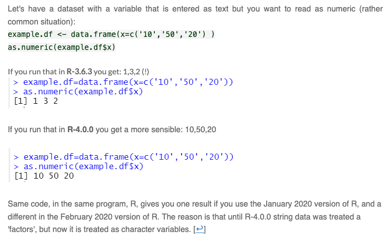

:::note
Managing external dependecies is critical to ensuring that you can maintain computational reproducibility when you move your code to a new computer.
:::

> If you wish to make an apple pie from scratch, you must first invent the universe

-- Carl Sagan

## Dependencies

Dependencies are essentially prerequisites -- the things you need to complete a task. For example, so far, we require both R and some of the packages in `tidyverse` to run the code we've written. Dependencies -- and tracking dependencies -- are a significant issue in computationally reproducible research.

Part of good research data management when using a scripting language is finding ways of tracking and documenting dependencies. At it's simplest, this means recording somewhere:

* your operating system and version
* your scripting language and version
* your extra packages or libraries and their versions.

This information provides a framework for creating a computationally reproducible environment. But even this documented framework can be insufficient.

## Environments

We can break addressing dependencies down into three distinct categories, levels, or environments that need to be addressed:

* Keeping a stable R environment
* Maintaining relationships to external programs
* Keeping a stable operating system environment

### Stable R Environment

We've talked about base R and about extending it with additional packages or libraries. It is very possible that an updated package or an updated version of R could break your code.

Base R packages are generally quite robust to backwards compatability, but not always. For example, when R 3.6 was released, [an update to `set.seed()`](https://github.com/workflowr/workflowr/issues/215) that is used for reproducible results when random number generation is needed -- i.e. you need to take a random sample from your dataset -- broke several packages that relied on `set.seed()`. Similarily, when R 4.0 was released, [updates to the matrix object](https://journal.r-project.org/archive/2020-2/core.pdf) had it's class changed from `array` to `c("matrix", "array")` breaking any packages that relied on testing the class of this datastructure using `class()`. Finally, we've been working with factors, so another, potentially more relatable example is the change made with the update to R 4.0 to not have characters translated to factors by default on import. This change risked breaking a lot of code. [See this example from Uri Simonsohn with Data Colada](https://datacolada.org/95#footnote_0_5852):



This kind of break is much more common with external packages. The above Data Colada article provides a few examples and links to others. But since we'll be using the `distinct()` function from the `dplyr` package that is part of the TidyVerse tomorrow, we can use that as an example, where a 2016 update to the function chagned it's default behaviour effectively reducing the number of variables preserved by the function. Running a script written with the earlier version of `distinct()` could well break under a later version of the same function. This is common enough to be a significant issue.

More importantly, this may not happen just on your machine. We want to make sure that your code is transferable to another person's computer and will still run. We'll explore one solution to this in R, but first look at what happens in additional to R packages that can cause issues when code is moved to another computer.

### External programs

Some R functions and packages are reliant on external programs. The `knittr` package that allows RMarkdown documents to be converted between document types (producing html, pdf, etc documents), and that we will be using later in this workshop, is a good example of this. It can be challenging to ensure that over time and across systems your .Rmd files will in fact output in the way that you expect; this doesn't nullify your code, just the conversion process from .Rmd to .html or .pdf.

Another example is being able to read Excel files into R. And this will lead us into the next consideration of keeping a stable system. There is more than one package available in R to load in Excel files. One, `xlsx` requires that Java, another programming language, be installed on the user's machine. Not everyone has Java, or the right version of Java, installed on their machines. `xlsx` is very prone to breaking code across machines. A second is `readxl` from the tidyverse. `readxl` uses two libraries whose licensing allows for redistribution with someone else's code, so, `readxl` includes and installs these libraries when the `readxl` package is installed. It is very robust when moved across computers and operating systems.

Maintaining relationships to external programs is very challenging. If using packages external to base R and the tidyverse, you should read about these packages first and learn about their dependencies and use them only if they work with your needs as they relate to reproducibility, and, as necessary, maintain robust documentation about them.

* [`xlsx` documentation page](https://cran.r-project.org/web/packages/xlsx/index.html)
* [`readxl` documentation page](https://cran.r-project.org/web/packages/readxl/index.html)

### Keeping a Stable System

We mentioned above that `readxl` uses two external libraries -- this is very common in computer programs -- if one person has solved a problem, i.e. how to read in proprietary Excel files into another application, and is willing to share that solution, no one else needs to solve that same problem. However, for a variety of reasons, not all 'shared' libraries, as these are referred to, can be bundled the way they are in `readxl`. In these instances, these libraries usually sit somewhere else that is globally accessible to any application on your computer. The only way to resolve this kind of dependency is to make a copy of your entire operating system that includes any external programs and your R environment.

This is far more than we cover here, but a popular option is to create a copy of your complete computing environment using an application called Docker.

### Overall Considerations

Consider what your specific needs are before venturing down these routes. A small project written in only base R likely needs only to record the version of R it is using. A project that uses only self contained external R packages only needs `renv`. A project that has external program dependencies may suffice to simply document what these dependencies are and what needs to be installed to resolve them. It is only in large, complex projects, and one's where a risk assessment determines that computational reproducibility is critical, that you would consider resorting to a solution like Docker.

## A Reproducible R Environment

So how do resolve the R dependency problem? A popular option is with the `renv` package.

Before we begin, it's important to draw a distinction here between a package and a library in R. A package is a set of functions and data. We've seen many of the functions included in the `tidyverse` set of packages. A library is a place where these packages are stored on your computer. You can see where your packages are stored with `.libPaths()`.

```{r libpaths}
.libPaths()
```

Note that, by default, these are stored almost in the root of your operating system. So when you move your project folder, you don't also move your additional packages.

The easiest way to handle this, is to use the package `renv`, which isntalls your packages in your project folder as well and maintains detailed information about them so that should they need to be re-installed they can be and with the exact same version. Thus, you end up with a stable, reproducible R environment.

#### renv in Action

First we install, load, and initialize `renv` -- this only needs to be done once.

```{r install-renv, eval=FALSE}
install.packages("renv")
renv::init()
```

```{r init-renv, results='hide', echo=FALSE}
renv::init()
```

:::note
You'll notice that we're using a different way of calling the `init()` function here, first noting the package that it's in `renv` followed by two colons `::`. Similarly to how in day 2 we loaded all of Tidyverse with `library(tidyverse)`, but on day 3 we only loaded one package from the tidyverse, `dplyr`, to trim down how much we were loading into memory, we can also load only specific functions from a package that is installed - we don't call `library()`, we just reference the installed package, and then call the function of interest.
:::

The `init()` function does a couple of things. It:

* populates your .Rprofile with a line to be read every time you launch your project to `activate()` `renv`
* creates a `renv/` directory where your local libraries are installed.
* creates a `renv.lock` file that maintains metadata about the libraries you're using in the project.

In fact, if we run `.libPaths()` again, we'll see there's a second library now.

```{r}
.libPaths()
```


Once intialized, `renv` is ready to start installing packages locally. If you already have saved .R or .Rmd files, `init()` will attempt to locate the packages your're using and install them locally. If you're initializing `renv` before saving any files, you'll need to manually install the packages you'll be using going forward, even if we've installed these and they are present in `.libPaths()`; at this stage, `renv` only looks in our project folder for packages.

`renv` has an install function that is more verbose than `install.packages()` from base R.

```{r install-tv, eval=FALSE}
renv::install("tidyverse")
```

Installing a package doesn't add the details of this package to your `renv.lock` file; this only happens you actively call a package in an .R or .Rmd file and instruct it to make a record of the change. First we load the newly installed package.

```{r load-tv, eval=FALSE}
library(tidyverse)
```

Then you take a `snapshot()`, which tells `renv` to document the packages you've used in your scripts. In our case, we only need to do this once, since we're only using packages that are contained within `tidyverse`.

```{r install-rprojroot, echo=FALSE}
renv::install("rprojroot", prompt = FALSE)
```

```{r snapshot}
renv::snapshot()
```

This is what the `renv.lock` file looks like on the inside:

```{bash, echo = FALSE}
cat renv.lock | head -n 20
```

Packages can take up a lot of space, so generally, you don't share your packages, or library folder, with others when you share your R project. Instead, you just share a few of the `renv` generated files, including the:

* `renv.lock` file -- the metadata about the packages used
* `.Rprofile` file -- launches `renv/activate.R` at startup
* `renv/activate.R` file -- checks the setup on startup and will install `renv` if it's not installed
* `renv/settings.json` file -- settings for `renv`.

This set up is intended for using a version control system like Git. We're going to simplify things for ourselves here by only using the `renv.lock` file when sharing. So, you can ignore the hidden file `.Rprofile` and the `renv/` directory.

This does mean that any collaborators will need to install `renv` first on the their machines. Then, they run `renv::activate()`, which gets `renv` up and running in the project, followed by `renv::restore()`, which rebuilds your R environment on their machine.

At the end of today, when we upload our data and .Rmd files to OSF, we will now also include the `renv.lock` file. We should also update our readme with the `renv` setup instructions.

Read more about the `renv` package at [https://rstudio.github.io/renv/articles/renv.html](https://rstudio.github.io/renv/articles/renv.html)

```{r deactivate-renv, results='hide', echo=FALSE}
renv::deactivate(clean = TRUE) # get rid of renv so the website builds properly
```

<sup>1</sup> Simmons, J. P., Nelson, L. D., & Simonsohn, U. (2011). False-Positive Psychology: Undisclosed Flexibility in Data Collection and Analysis Allows Presenting Anything as Significant. Psychological Science, 22(11), 1359-1366. [https://doi.org/10.1177/0956797611417632](https://doi.org/10.1177/0956797611417632)