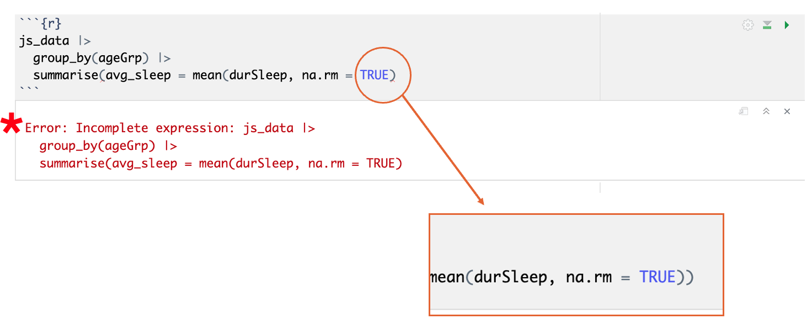
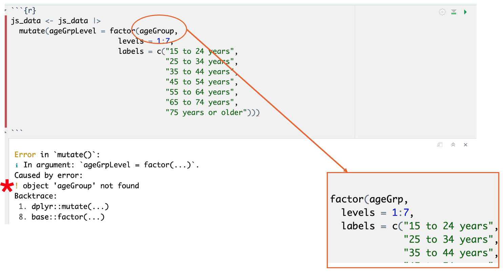
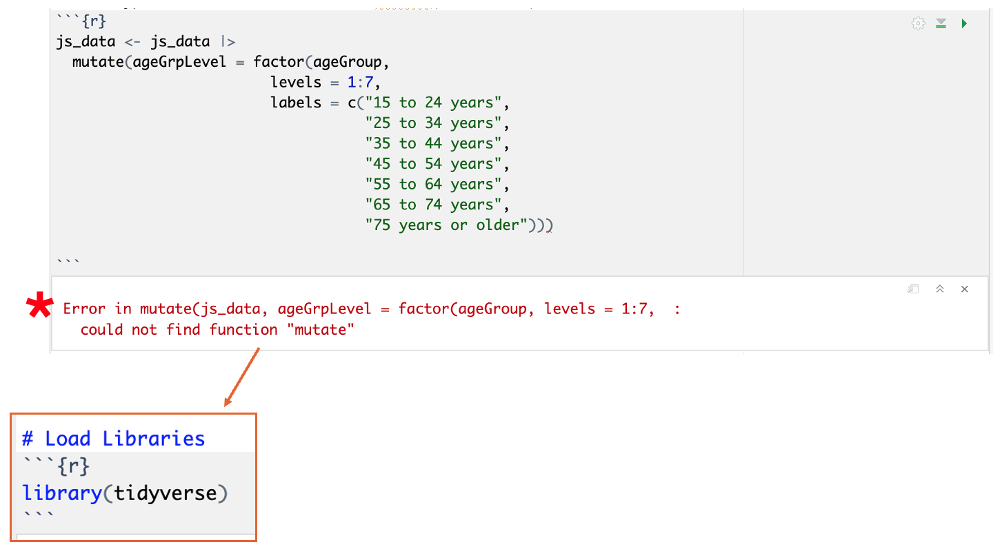

```{r setup, include=FALSE}
knitr::opts_chunk$set(message = FALSE, warnings = FALSE)
```

## Introduction

:::into
Understanding and fixing errors is one of the most important (and sometimes frustrating!) parts of learning R.
:::

In this tutorial, we will:

- Learn how to understand and solve errors in R
- Get familiarized with the most common error types in R

## Troubleshooting Errors in R

In R, errors occur when the code you write can’t be executed due to problems like typos, missing packages, incorrect function arguments, or misused data structures. When R encounters an error, it stops running the code and shows a message that gives clues about what went wrong. These messages can seem cryptic at first, but they usually point to the exact line or object causing the issue. 

Error messages are not always clear. For example, trying to use a column that doesn’t exist in a dataset will result in an error like “object not found”.

Learning to read and interpret these messages is a key part of becoming confident in R, as they help you troubleshoot and fix mistakes efficiently. As you gain experience, you’ll begin to recognize common patterns and learn how to resolve them quickly.

## Got an Error: What to do?

Keep calm!

 - Start by trying to identify what the error is: double check your code for simple mistakes 
 - Consult the package description to understand how each function works
 - Try to look for a similar error online (a quick search often guides you to a forum with someone facing a similar issue)
 - Use AI to understand what the error is referring to, or check a small part of your code
 - Ask someone else to take a look! (last option, the best path for learning is trying to figure out what is wrong by yourself)
 - Ask for help in a forum

## Common Errors in R
 - Not including a closing parenthesis, curly brace, square bracket or quotation mark
 
 
 
 - Typos or mistakes in names of datasets, variables, or functions
 
  
 
 - Calling a function of a library we forgot to install or load
 
  
 

## Team Challenge (30 minutes)
In small teams, you will work together to troubleshoot some errors in R. We've created a RMarkdown file with some code related to the same Time Use dataset we've been using this week. You will notice a lot of errors when trying to run the code. 

Take note of how many errors you encounter and what you do to solve them. 

Come back to the main room when you're done. 


