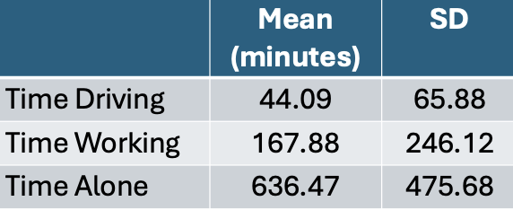
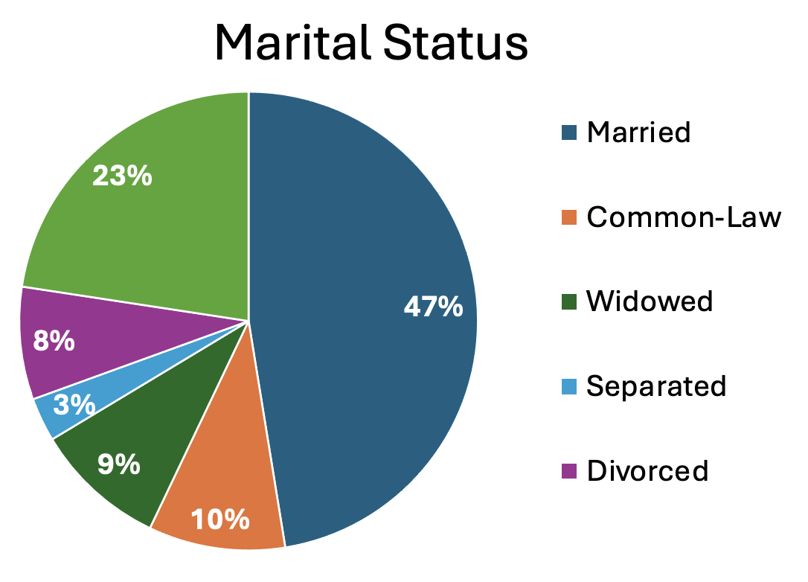

```{r, libraries, include = FALSE}
library(kableExtra)
library(ggplot2)
library(dplyr)
```

```{r setup, include=FALSE}
knitr::opts_chunk$set(echo = TRUE, message = FALSE, warnings = FALSE)
```

```{r, include = FALSE}
load("data/timeuse_day3_2.Rdata")
```

<h4 style="text-align:center;"><strong>Data visualization is an important part of exploring, understanding, and sharing our data.</strong></h4>

## Data Visualization in R

Data visualization is a critical part of the data science workflow. Through visualization we can explore and understand our own data, informing further analyses. Additionally, data visualizations are a powerful tool for communicating data and research findings to other people. Visuals can often more efficiently and more effectively tell the story of your data, rather than only relying on writing. Well done data visualizations will often have the biggest impact on an audience in a science communication context. 


[Source](https://telapps.london.edu/analytics_with_R/tidyverse.html)

In this session we have a few main goals. 

1. Introduction to types of data visualizations
2. Discuss what makes a good visualization
3. Review and critique some data visualization examples
4. Introduction to ggplot to generate visualizations in R

### Types of Data Visualization

Data visualizations can be descriptive in nature, such as portraying the demographic distribution of a group people, or can represent statistical findings, such as a regression line with a confidence interval overlayed on a scatter plot of data. In certain contexts it is also common to present data and information in more easily digestible infographics <a href="https://coolinfographics.com/">(check out some examples here)</a>, that enter more of a graphic design space. Different data visualizations fulfill different goals. Having a toolbox of a variety of data visualization types can help you pick the best type to fit your needs for a given project. 

#### Table
Tables to collect and organize data are one of the most common and basic data visualizations. But don't discount them! They can be efficient ways to convey a large amount of information about your data all at once. 



#### Pie Chart
A classic pie chart is useful for representing parts that add up to a whole. This also allows for comparing group sizes. Often used for demographic variables, with the whole representing the whole sample, or for representing money, with the whole representing a budget or total money spent/made. Careful to use a pie chart only when it really adds to the story. For instance, if there are only two parts to the whole, a pie chart might not convey much more information. Conversely, if there are many groups, it can become difficult to really see all of them and compare them. 



#### Box Plots
Box plots (also known as box and whisker plots) are good for understanding and comparing variance between groups. They typically depict the median and min/max of each group for a certain variable. The box portion represents the 1st and 3rd quartiles of the distribution. You can also show change over time with this type of plot. 

```{r, echo = FALSE}
ggplot(js_data, aes(x=as.factor(province_fact), y=durSleep)) + 
    geom_boxplot(fill="#2D5E7F", alpha=0.6) + 
    xlab("Province") +
    ylab("Minutes SLeeping") +
 theme(text = element_text(size = 18))
```

#### Histogram 
Histograms display the distribution of one variable. The height of the bars represent how many times that value was represented in the data. This is typically what you view if you want to visually inspect if a variable in normally distributed. 

``` {r, echo = FALSE}

ggplot(js_data, aes(x=durSleep)) + 
  geom_histogram(fill = "#2D5E7F", color = "black")+
  xlab("Number of Minutes Sleeping") +
  ylab ("Number of Participants") +
  theme(text = element_text(size = 18))
```

#### Bar Chart 
Bar charts are good for representing data from groups or categories, with the bars representing different categories. The bar height usually represent a mean, a count, or a percentage, by category. These can be useful for comparing groups or showing change over time. 

``` {r, echo = FALSE}
ggplot(js_data, aes(x=maritalStat_fact, fill = as.factor(maritalStat_fact))) +
  geom_bar() + 
  xlab("Marital Status") +
  ylab ("Number of Participants") +
  scale_fill_hue(c = 60) +
  theme(legend.position = "none",
        text = element_text(size = 18),
        axis.text.x = element_text(angle = 35, hjust = 1))
```

#### Scatter Plot 
Scatter plots include data points that are plotted along an x and y axis, showing the relationship between these two variables. Often researchers add a regression line or line of best fit to these plots to show the statistical relationship between the variables. 

```{r, echo = FALSE}
ggplot(js_data, aes(durWork, durSleep)) +
  geom_point(color = "#2D5E7F", alpha = .2) +
  geom_smooth(method=lm, se=TRUE, color = "black") +
  xlab("Minutes Spent Working") +
  ylab ("Minutes Spent Sleeping") +
  labs(title = "Association Between Working and Sleeping") +
  theme(text = element_text(size = 18))
```

#### Line Chart 
Line charts used connected straight lines to display data. They are good for showing change over time on a continuous variable. They are often similar in purpose to bar charts, but visually simpler if there are many time points. 

```{r, echo = FALSE}
xValue <- 1:7
yValue <- c(1303, 2127, 2597, 2789, 3741, 2958, 1875)
plotdata <- data.frame(xValue,yValue)

ggplot(plotdata, aes(x=xValue, y=yValue)) +
  geom_line(color = "#2D5E7F") +
  xlab("Age Groups") +
  ylab ("Number of Participants") +
  labs(title = "Number of Participants per Age Group") +
  theme(text = element_text(size = 18)) +
  scale_x_continuous(breaks = seq(1, 7, 1)) +
  scale_y_continuous(breaks = seq(0, 4000, 500))

```

#### Interactive Data Visualizations 
As research and publications move more online and away from print, this can allow for more interactive data visualizations. These are types of data visualizations that allow a person to select and change what is being shown. Check out this great example from <a href="https://www.gapminder.org/tools/#$chart-type=bubbles&url=v2)">Gapminder</a>. The default visualization shows GDP and life expectancy over time, and by country. However, you can change the variables included to view other data. 

#### So many more! 
- Heat Map
- Stacked Bar or Stacked Area Chart
- Violin Plot
- Gantt Chart
- Choropleth Map

### What Makes a Good Visualization?
There is an art to picking the best data visualization that fits your data and the story you are telling. By nature, data visualizations are abstract representations of our data, with color, shape, position representing the data points. This both hides the exact data itself, while also allowing us to highlight bigger picture ideas about the data that we choose to emphasize. Consider the following: 

- What question are you exploring with your data and how will it inform future analyses?
- What is your data visualization adding to your science communication? 
- What take-away message are you conveying with the image? 
- What type of variables to you have? Continuous? Categorical?
- Are you comparing groups?
- Are you showing change over time?
- Are you visualizing a relationship between variables?

It can be easy to get in the habit of using the same types of data visualization over and over again. Check out this website that gives many creative data visualization options, categorized by goal:<a href="https://r-graph-gallery.com/ ">https://r-graph-gallery.com/ </a>

#### Good Data Visualization Princicples
Once you pick the format that fits your needs best, these are some principles to keep in mind when crafting your visualization to make sure it is clear to your audience. 

**- Clear Data:** Consider the format of your data when you include it. Your data needs to be unambiguously communicated to your audience. For instance, do you have so many groups that they are difficult to differentiate? Are your data points stacked on the same spot so the audience can't see the density of your data points?

**- Clear Labels:** All data visualizations need labels. This may be the axis on a scatter plot, legends for your bar graph, or percentages on your pie chart. You must tell the audience what they are looking at. If different colors are used, they should represent some aspect of the data and be clearly labeled. 

**- Clear Scales**: Clear and consistent scales are important to avoid misinterpretation of your data visualization. An axis should be clearly labeled and include the full scale range. Make it clear if the scale does not start at 0. Scales should be consistent across visualizations to allow for comparisons. 

**- Simplicity:** Aim to have uncluttered data visualization. It is easy to get excited about all you can do creatively in the world of data visualizations, but sometimes adding too much (e.g., extra colors, pictures) can actually obscure your main message. Avoid extra info that doesn't add to the story you are telling.

**- Accessibility:** Consider how your data visualization design would be viewed by a variety of other people. Text font and size for legends and axis labels should be clear and not too small. Try not to rely only on color to distinguish groups (e.g., lines can be dashed or doted), or pick colors/hues that are distinguishable by people who are colorblind. Include alternative text descriptions that can be read aloud by a screen reader. 

For more information on how design principles and the visual hierarchy of elements check out <a href="https://www.interaction-design.org/literature/topics/visual-hierarchy?srsltid=AfmBOooU77XPiVsXSkE7t2GqAayaOyh0VxdwGj3bJaP1Qj3xcc5A44BW>this article</a>. Size, color, contrast, alignment, repetition, proximity, whitespace, and texture can all be used to draw focus to particular visual elements. 


### Your Turn!
One of the best ways to get into data visualization is to get inspired from some of the amazing data visualizations that already exist! 

We have two websites with a variety of data visualization examples. 

- <a href="https://r-graph-gallery.com/best-r-chart-examples">R Graph Gallery</a>
includes many examples of data visualization created in R. These also include tutorials/R Code used to make them. These examples go beyond what we will cover in this workshop, but serve as great inspiration for how much you can do in R!

- <a href="https://www.tableau.com/viz-gallery">Tableau Viz Gallery</a>
includes examples created with the platform Tableau. This is a proprietary (paid) platform which we are not using in this workshop, but this gallery still has some great examples to help inspire your data visualization creativity! 

:::question
In small groups, on either of these websites, find a data visualization example that jumps out ot you as interesting and then answer the following questions. 

1. What captured your attention about this data visualization? The topic? The design? 
2. What is the story this example is trying to tell? What is one of the take-away messages it is conveying?
3. What do you like about this visualization? Does it convey information about the data in a uniquely effective way? Does it adhere to the principles we discussed? 
4. Is there anything you find confusing about this example? Antying you think is missing or that you would change to improve it? 
:::

### ggplot R Package

Now that we have our data visualization imaginations going, let's get into how we can visually represent our data in R.

The go-to package for data visualization in R is `ggplot2`, which is part of the tidyverse. You can find more information about `ggplot2` on the <a href="https://ggplot2.tidyverse.org/">tidyverse website</a>.

This package approaches data visualization through "a grammar of graphics." In other words, using the same syntax, you can create an infinite number of data visualizations. Although there are a lot of functions and components to learn at first, once you understand the overall structure of building graphics in `ggplot2`, you can replicate and expand on this structure to visualize data in an unlimited number of ways. 

If you have installed the tidyverse, then `ggplot2` is included. Otherwise you can install it now. Let's also load our dataset for today.

```{r}
#install.packages("ggplot2")
#library(ggplot2)
```

Although there are many ways to make data visualizations in R, other approaches tend to be more automatic and consequently limit the amount you can change and adapt your visualization to your needs. However, `ggplot2` works in layers, allowing for maximum control and flexibility. There are three categories of components commonly used in `ggplot2`.

1. **Geometries:** Visual representations of the data. This is often lines, points, box, histograms etc.
2. **Attributes:** Set values for the visual properties of geometries. This could include the color of bars on a bar plot or the shape of a line.
3. **Aesthetics:** Values of visual properties of geometries that vary depending on the data. This could be the color of a line varying based on gender. 

Here are some of the most common layers (i.e., functions) used in `ggplot2`. Typically you connect these layers using the `+` symbol. There is often more than one way to build the same plot with the `ggplot` package. 

**- `ggplot()`:** how you will start most plots you build in `ggplot2`. The rest of the information goes within this function.

**- `aes()`:** this is the aesthetic mapping function, in which you can control aesthetic components of the plot. You can add colors, axis labels, font sizes and more within this function. Color and shape can be defined both within and outside of the aesthetic funtion. 

**- `geom_point()`:** used for making a scatter plot

**- `geom_line()`:** used for adding a line to a plot

**- `geom_histogram()`:** used for making a histogram

**- `geom_col()`:** used for making a bar plot

**- `xlab`, `ylab`, and `labs(title = )`:** used for adding axis labels and an overall title to plots

**- `color`:** assigns a color to part of the plot, such as different groups or the data points

**- `fill`:** assigns the interior color of part of the plot, such as a confidence band or the bars in bar plots

**- `alpha`:** used to change the transparency of a component of the plot. Useful if you lots of have overlapping data points or distributions from multiple groups. 

**- `size`:** used to set the size of part of the plot, such as how big the data points or text should be

There are an infinite number of data visualization options in `ggplot` but to get started today we are going to focus on making a bar plot (good for categorical data) and a scatter plot (good for continuous data). 

### Basic Bar Plot-Counts
Let's make our first plot in R! We are going to slowly add layers, building up to a box plot representing the number of people in each group in the `isFeelRushed` variable. 

First we create the blank plot on which we will add our data. We nearly always start with the function `ggplot` and then telling the function what dataset to use. 

```{r}
ggplot(js_data)
```

Next we tell ggplot what variable we want to use and put it in the `aes()` function. If you want a bar chart representing the number of people in each group, you can add just one variable to the `aes()` function. We include the `as.factor` function around the `isFeelRushed` variable so it is treated as a categorical variable for the box plot instead of a numeric variable. You will see now that the grid represents a scale relevant to that variable. 

```{r}
ggplot(js_data, aes(x = as.factor(isFeelRushed)))
```

Next, we tell ggplot what type of data visualization we want. To create a bar chart we use the function `geom_bar()`. To see how many people are in each of the `isFeelRushed` groups, we use the default `geom_bar(stat = "count")`. Remember that we connect layers with a `+` symbol. 

```{r}
ggplot(js_data, aes(x = as.factor(isFeelRushed))) +
  geom_bar(stat = "count")
```

Lastly, let's add some labels to the x-axis and y-axis to make it clear what is being plotted. 

```{r}
ggplot(js_data, aes(x = as.factor(isFeelRushed))) +
  geom_bar(stat = "count") + 
  xlab("Feeling Rushed") +
  ylab ("Number of Participants") 
```

### Basic Bar Plot-Group Means

Building from yesterday, let's see if people who feel rushed tend to work more than people who do not feel rushed. To represent the mean for each group on some other variable, you add both and x and a y variable to the `aes()` function and use the `geom_bar(stat = "summary")`. Note that the Y-axis scale has now adjusted to a scale that matches this the variable we are using (i.e., mean number of minutes spent working for each group). 

```{r}
ggplot(js_data, aes(x = as.factor(isFeelRushed), y = durWork)) +
  geom_bar(stat = "summary") + 
  xlab("Feeling Rushed") +
  ylab ("Time Working") 
```

:::walkthrough
  - Most plots will start with the `ggplot()`function
  - You have to include object where `ggplot()` will get the information for the plot from. In this case our dataset `data`
  - Within the `aes()` function, we identify what the x and y variables are for this plot
  - We add layers using the `+` sign
  - Next we tell `ggplot()` what type of plot we are making; in this case we are creating a bar plot using the function `geom_bar()`
  - Then we add what type of statistic we want presented on the plot. Here we ask for the mean of each group for the variable durWork using the function `geom_bar(stat = "summary")`
  - We add a label to the x-axis with `lab("Feeling Rushed")`
  - We add the label to the y-axis with `ylab ("Time Working")`
  
:::

### Improved Box Plot! 
This plot gets the idea across, but we can add more layers and functions to make more adjustments. 

```{r}

plotlabels <- c("Not Rushed", "Rushed", "Did Not Respond")

ggplot(js_data, aes(x = as.factor(isFeelRushed), y = durWork)) +
  geom_bar(stat = "summary", fill = "#2D5E7F") + 
  xlab("Feeling Rushed") +
  ylab ("Time Working") +
  labs(title = "Working and Feeling Rushed") +
  scale_x_discrete(labels = plotlabels) +
  theme(text = element_text(size = 18),
        axis.text.x = element_text(angle = 25, hjust = 1))
  
```

:::walkthrough
  - We can change the color of the bars using `fill = `. Here we added the specific color using a hex code. But you can also write in the names of colors such as "blue."
  - Using `labs(title = "")` we added an overall title to the plot
  - We probably want what each category represents, rather than the "0", "1" and "NA" labels. To add text labels, we first create an object with each of those labels in order
(`plotlabels <- c("Not Rushed", "Rushed", "Did Not Respond")`). The in the `scale_x_discrete(labels = plotlabels)` function we call to that object we created as the labels for the x-axis. There are many other ways to adjust the labels for each axis, but this method works well for a small number of groups.
  - In the `theme()` layer you can add many different specifications. Here we added `text = element_text(size = 18)` to make the text size bigger than the default and made the x-axis labels angled so they fit better using `axis.text.x = element_text(angle = 25, hjust = 1)`. The `hjust = ` adjust the vertical location of the axis labels so they don't overlap with the plot itself. `vjust = ` can be used to move the labels right and left. 
  
:::

:::question
Try manipulating this plot some. Can you change the color of the bars? What happens if you change `angle = 90`?
:::

### Basic Scatter Plot
number of hours worked and feeling rushed? or some more continuous variable?

```{r}
ggplot(js_data, aes(durWork, durSleep)) +
  geom_point() +
  geom_smooth() +
  xlab("Minutes Spent Working") +
  ylab ("Minutes Spent Sleeping")
      
```

:::walkthrough
  - Again we start with the `ggplot()` function, including telling it to use the dataset `data`
  - In the `aes()` function we list the x and y variables (here durWork and durSleep)
  - The `geom_point()` function is what makes a scatter plot
  - The geom_smooth() is what adds the correlation line to the plot
  - The `xlab()` and `ylab()` add the x-axis and y-axis labels to the plot
  
:::
### Improved Scatter Plot!

Now let's add some layers and aesthetic adjustments to improve this plot.

```{r}
ggplot(js_data, aes(durWork, durSleep)) +
  geom_point(color = "#2D5E7F", alpha = .2) +
  geom_smooth(method = lm, color = "black") +
  xlab("Minutes Spent Working") +
  ylab ("Minutes Spent Sleeping") +
  scale_x_continuous(breaks = seq(0, 1500, 250)) +
  labs(title = "Association Between Working and Sleeping") +
  theme(text = element_text(size = 18))
```

:::walkthrough
  - We can change the color of the data points by adding `color = "#2D5E7F"` and change the transparency of the data points (so you can see where there are overlapping clusters) with the addition of `alpha = .2`. 
  - In the `geom_smooth()` function we changed the method for calculating the line to be linear (instead of the ggplot default) using `method = lm` and adjusted the color of the line with `color = `. Remember you can write hex code numbers or the names of colors to adjust colors. Make sure both are in quotes to avoid error messages. 
  - We adjust the x-axis tick marks with the `scale_x_continuous(breaks = seq(0, 1500, 250))` part, which tells R to plot the x-axis on a sequence from 0 to 1500 (this captures all of the responses in our data), with labels every 250 minutes. 
  - The `labs(title = "Association Between Working and Sleeping")` adds an overall title to the plot
  - Lastly, `theme(text = element_text(size = 18))` adjust the text size
  
:::

:::question
Try manipulating this plot some. Can you make the data points more and less transparent? Can you change the color of the line? What happens if the x-axis has labels every 100 minutes?
:::

### Your Turn!
::: question
Take a look at our data set and make two new plots. 

1. Make a plot comparing groups (i.e., a categorical variable) on one of the duration variables (i.e., a continuous variable).

2. Make a plot comparing two continuous variables. 
:::

::: question

**Challenge:** What is one component of your plot you would like to change? Can you look up a solution? 
:::

