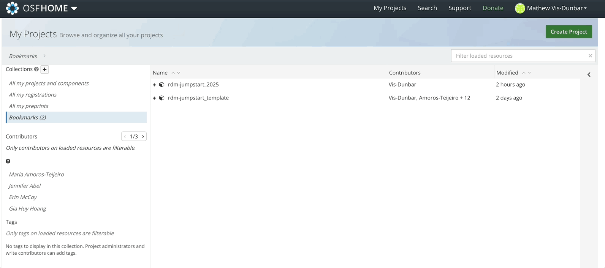

## osfr

First, it is necessary to get an API key from OSF. Do this by heading to your OSF project, your user settings, and selecting "create new key".



Keep that key safe, this is very important, ie don't share it with anyone.

That being said, we do need to store it somewhere so that `osfr` can access it. The most sensible place, and where `osfr` will look for it, is in a file called `.Renviron` in your home folder. We will first check if a `.Renviron` file exists already -- if it does, we'll add our key to it -- if it doesn't, we'll create it, and then add our key to it.

To do this, we'll use the 'Terminal' adjacent to the R Console.

```{bash, eval = FALSE}
# list all files in the home directory (~ is short for home, you can also try $HOME if ~ doesn't work)
# including hidden files (the -a does this)
# and then with grep, filter that list for the file name of interest
ls -a ~/ | grep ".Renviron"
```

If you're presented with a blank line, `.Renviron` doesn't exist. So let's create it.

```{bash, eval = FALSE}
touch ~/.Renviron
```

And we'll write our API token or key to the file, copying and pasting your key after the `=` sign below.

```{bash, eval = FALSE}
echo "OSF_PAT=" >> ~./Renviron
```

To validate this worked, you can run

```{bash, eval = FALSE}
cat ~./Renviron
```

You will need to restart R before this file and / or it's new information is accessible. To do this, go to `Session > Restart R` from the RStudio menu.

Next, we install, if not already installed, and load, `osfr`

```{r, eval = FALSE}
install.packages("osfr")
library(osfr)
```

```{r, echo = FALSE}
library(osfr)
```

You should get the above output, indicating that `osfr` has successfully found your API token so that you can authenticate.

## Accessing your project

Next, we download the metadata associated with our OSF project. You'll need the url from the landing page of your OSF project.

```{r}
jumpstart_project <- osf_retrieve_node("https://osf.io/uha5g/")
```

Then, we look at the list of files in our project:

```{r}
js_files <- osf_ls_files(jumpstart_project)
js_files
```

A small caveat here, this works more easily with files than directories, so we'll simply explore this with a single file, like the README.md file.

The `meta` column is a list of metadata associate with each file -- we need to access the unique id of the file we want to download before we can download it. This is the same 5 digit alphanumeric code that we would see if we loaded the file for viewing within OSF. So, you could access it that way too.

```{r}
readmeFile <- js_files$meta[[6]]$attributes$guid
readmeFile
```

We then download it. We need to resolve how to handle conflicts, and here, I'm simply going to elect to overwrite any existing file with the same name, as this is my first 'pull'.

```{r, eval = FALSE}
osf_retrieve_file(readmeFile) |>
  osf_download(conflicts = "overwrite")
```

Since this is a markdown file, it can be opened and edited directly in RStudio. Once you're done for the day, we can send it back to OSF and overwrite the one sitting on OSF servers.

```{r, eval = FALSE}
osf_upload(jumpstart_project,
           "README.md",
           conflicts = "overwrite")
```

As long as you don't change your file names, the unique ID of the files never changes. So, once you know what you need to routinely back up, you can get creative in automating this process using only `osf_upload()` to overwrite what's on OSF servers.

:::note
While OSF with provide access to the historical versions of these overwrites that you are performing, `osfr` is not a version control system, that is to say, it does not look for changes in files, it does not compare dates on files, etc, it simply completely overwrites.
:::


