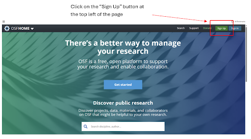
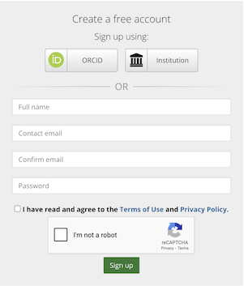

## Introduction 

OSF will be a platform that we use to share project files with you, and that you will use to backup that work that you do throughout the week. While OSF is web-based and doesn’t require any downloading, we ask that you create an OSF account:

Link to OSF: [https://osf.io/](https://osf.io/)

## Sign up

If you're with UBC, select 'Sign up using Institution'. If you have an ORCID, select 'Sign up using ORCID'. Alternatively, sign up with an email address of your choosing.

