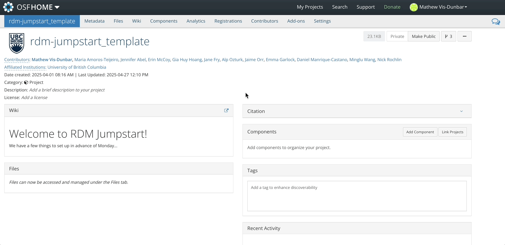
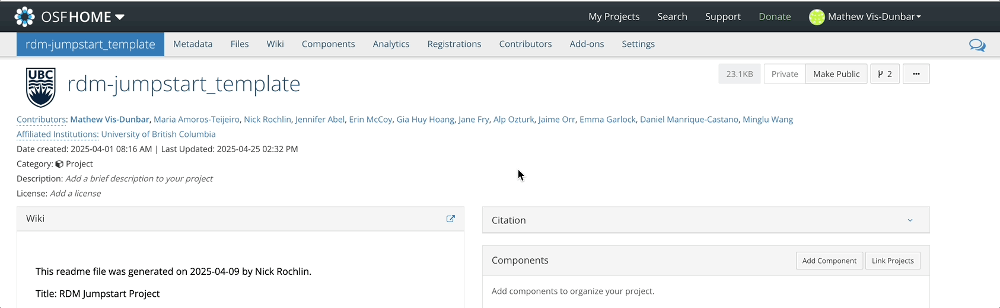
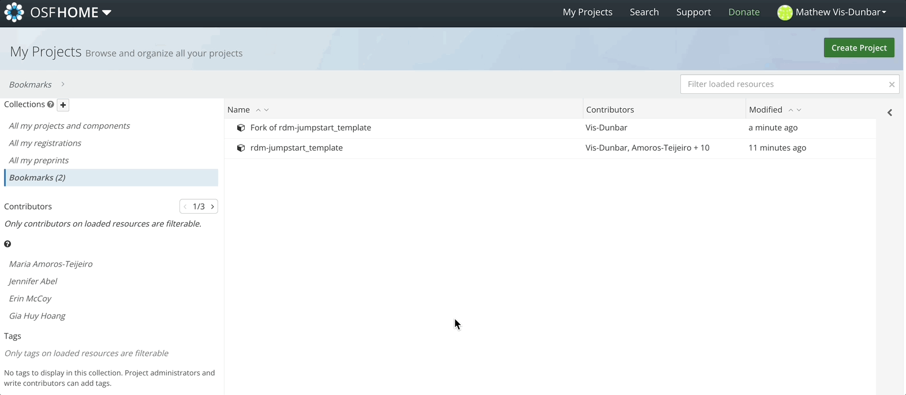
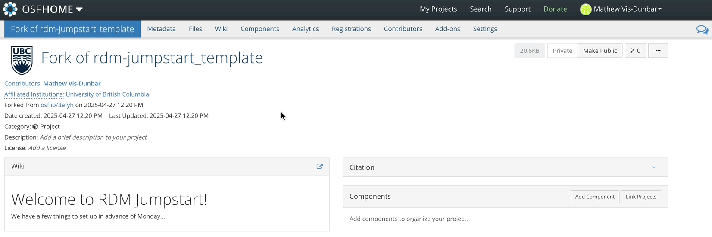
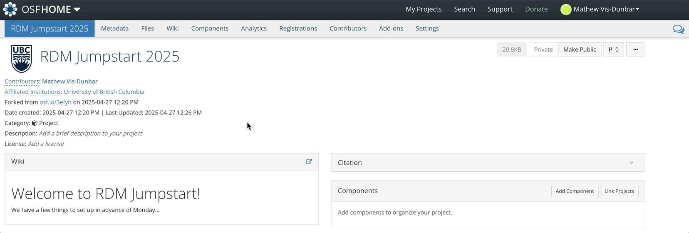
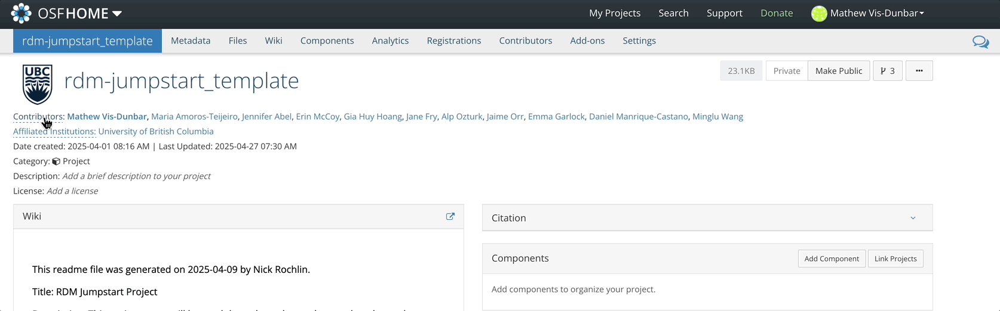
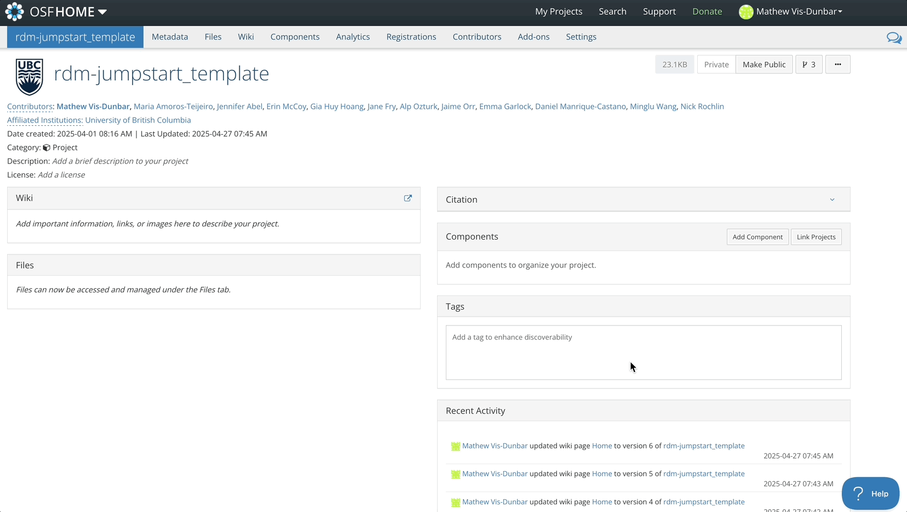
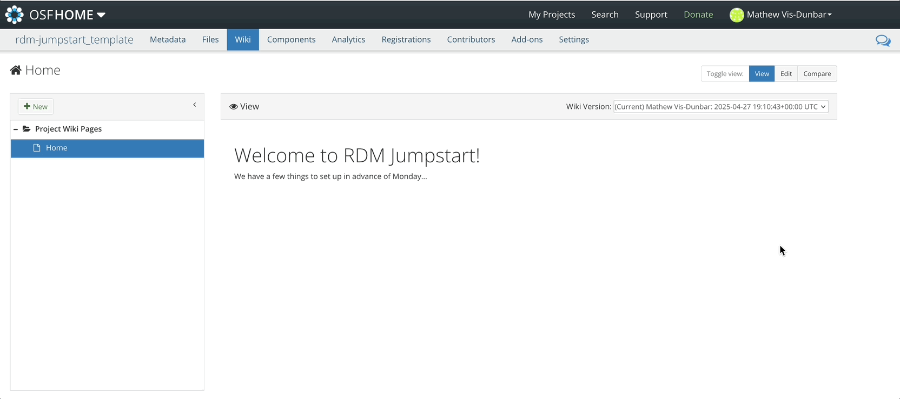
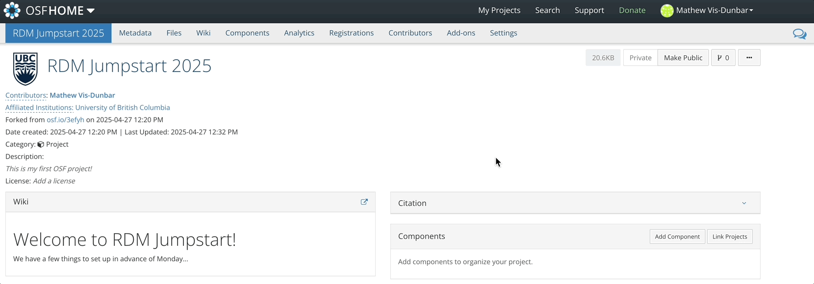
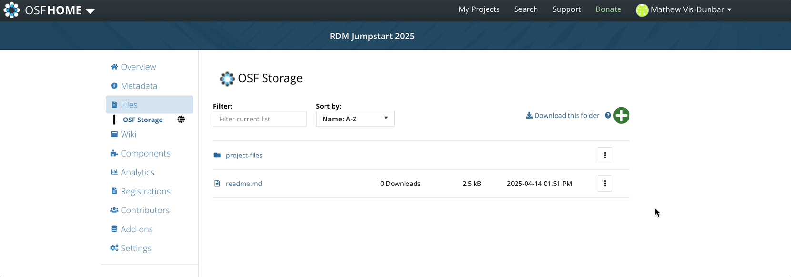

## Introduction to the Open Science Framework (OSF)

* [Download the PowerPoint](files/Block1-3_OSF.pptx)

<object class = "pdf" data = "files/Block1-3_OSF.pdf"></object>

 

## OSF

OSF is an online data storage platform that supports good research data management practices and facilitates collaboration, transparency, and reproducibility in research. It achieves this through provisioning descriptive metadata, version control, access permissions, persistent identifiers, and regional cloud storage options.

We will be using OSF as our backup storage solution for this workshop. As such, we will not be taking full advantage of all the project management features that OSF has to offer.

:::{.note}
Storage solutions that are supported by your institution will generally come with some form of risk assessment -- that is, a rating of how secure the storage platform is and how well protected your data are on it. Later, we will explore conducting a risk assessment of a data set. For now, note that OSF is really only suitable for low risk data; in this context, data where there would be no harm caused by its release to the public.
:::

### Setup

You will have hopefully already set up an account on OSF. If not, [you can follow the instructions here](6-EXT-osfSetup.html).

For this workshop, we have set up a template that we will have you fork -- or copy. This template can be found at [https://osf.io/3efyh/](https://osf.io/3efyh/)

The steps that we'll be covering in this session include:

* Setting storage preferences
* Forking the project template
* Naming your project
* Adding a description
* Adding collarborators
* Working with the Wiki
* Reviewing file organization
* Downloading files

In future sessions we will look at:

* Uploading files
* Version Control of Uploaded files

### Storage Localization

OSF storage can be localized to specific regions, and you can set your defaults in your profile settings.

### Forking a Project

Forking an OSF project will duplicate the structure of the project as well as copy any files residing in the original project over to the forked project. 

Once the fork is complete, you will see this fork under 'My Projects'. Forking a project will also maintain a connection with the original project from which it was forked.

### Updating the Title

To update the title of your forked project, simply click in the title field, start typing, and hit enter or select the green check mark.

### Adding a Description

Similarly, to add a brief description, click in the description field, start typing and hit enter or select the green check mark.

### Adding Contributors

Contributors can be added with three levels of access:

* Read
* Read + Write
* Administrator

Administrators are able to delete and publish projects, as well as override a handful of other activities on the project. It is good practice to have project leads as administrators and contributors with read + write.

### Wiki

The wiki in OSF uses Markdown. You can also source content from an existing file using the syntax `@[osf](uid)` where `uid` is the unique alphanumeric code assigned to an uploaded file.

The wiki also supports version control and comparing between versions.

### File Storage

Files uploaded to OSF are accessible through the files navigation tab.

### Downloading Files

Files can be downloaded invidually, or as a zipped folder.

