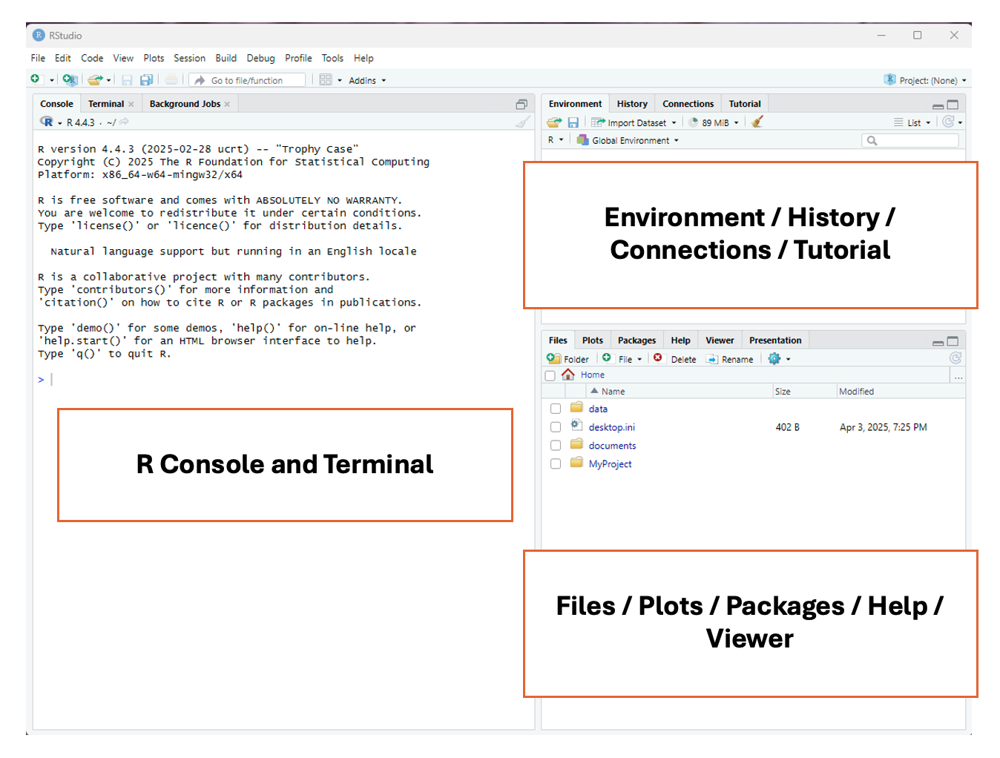
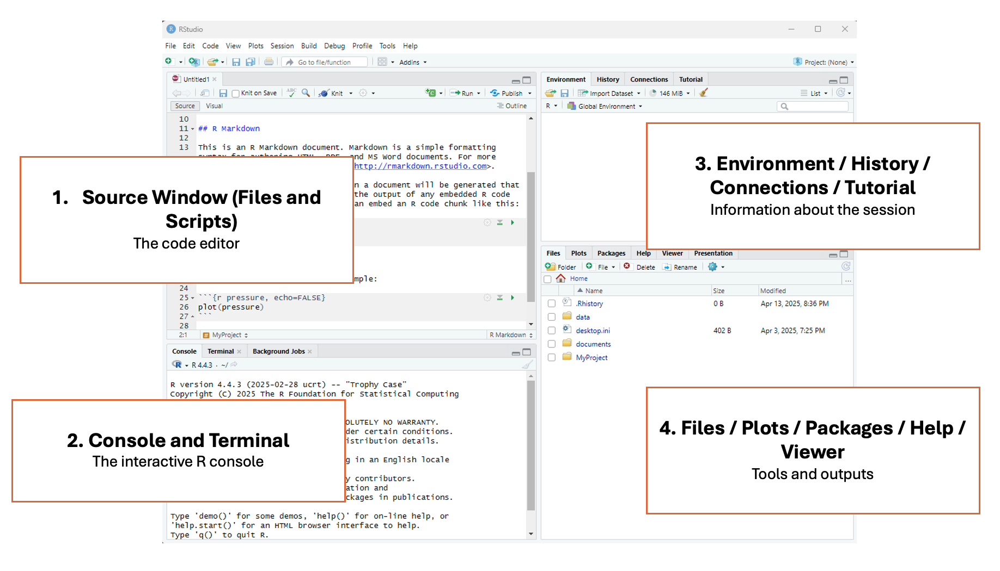
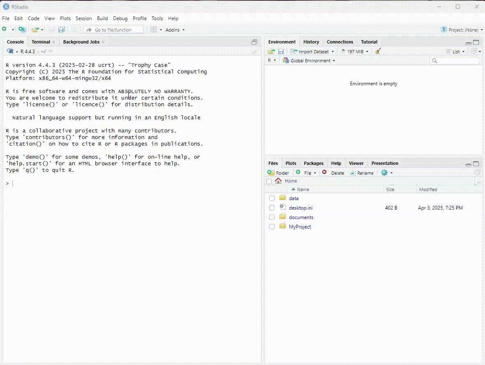
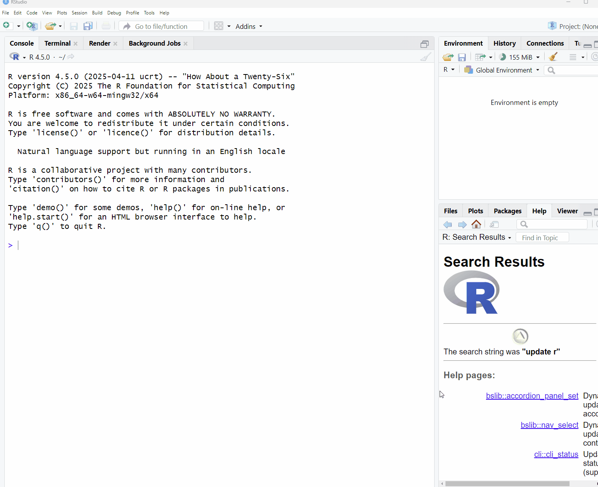
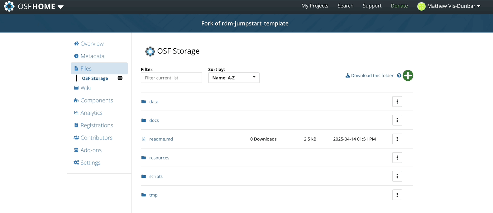

```{r setup, include=FALSE}
knitr::opts_chunk$set(message = FALSE, warnings = FALSE)
```

## Introduction to R

:::intro
RStudio is a program that helps you write and run R code more easily, especially for working with data, making graphs, and doing statistics.
:::

You will have hopefully already downloaded R and RStudio.  If not, follow the instructions on this page: <a href="Block7_EXT-RRStudio.html">R and RStudio setup</a>


## RStudio Interface

When we launch RStudio for the first time, we notice three main panels or quadrants: 



Once we open a document, the interface will show four main panels:



### 1 - Top left panel
#### Files and scripts (source window or code editor)

This is your code editor, where you write, save, and run R scripts (.R), RMarkdown documents (.Rmd), or other file types.

### 2 - Bottom left panel
#### R console and terminal

This is the interactive R console, where code is executed immediately. You can:

 - Type and run commands interactively (great for testing small bits of code).
 - View outputs, error messages, and warnings in real time.
 - Switch to the Terminal tab for system-level commands.

### 3 - Top right panel
#### Objects, history, environment, tutorial and connections

This area lets you track what’s happening in your R session.

It has different tabs for different actions: 

 - **Environment:** See all objects (like data frames, functions, variables) currently in memory.
 - **History:** View all commands you’ve previously run.
 - **Connections:** Manage database connections.
 - **Tutorial:** View built-in interactive tutorials (from the learnr package).

### 4 - Bottom right panel
#### Tree of folders, plots, packages, help, viewer

This panel contains various tools and outputs:

 - **Files:** Navigate your folder structure and open scripts.
 - **Plots:** View visualizations generated by your code.
 - **Packages:** Install, load, or update R packages.
 - **Help:** Search R documentation (`?function_name` shows here).
 - **Viewer:** View HTML content, like R Markdown outputs or Shiny apps.

## R Projects 

### Setting working directory

Most R tutorials and books teach the function `setwd()` for setting the working directory. This function manually sets the working directory during an R session. It tells R where to look for files and where to save outputs just for that session.

But here’s the problem...

Using `setwd()` can break your code when:

 - Someone else tries to run it on their machine.
 - You move your project folder.
 - You're running your code on a server or in cloud environments like RStudio Cloud.

Since file paths are hardcoded and depend on your machine, **it's not reproducible**.

### Create an R Project

An R Project is a feature in RStudio (and supported in base R too) that provides a self-contained working environment. When you create an R Project it creates a .Rproj file in a folder and that folder becomes the root directory of your project. Every time you open the project (via the .Rproj file), R automatically sets the working directory to that folder. You can reference files relative to the project root — no need to hardcode file paths.

This is super useful when you're working on multiple analyses, sharing code with collaborators, or version-controlling with Git. **It is a good practice for reproducible research**

To create an R Project, select File > New Project




## Types of files in R

There are two main types of files we can create in R studio to edit our code (R script files `.R` and RMarkdown files `.Rmd`)

The R script file (`.R`) is a plain text file that contains R code only. Use it when you want to write and run code line-by-line, such as for data cleaning, analysis, or function building. It's good for experimenting, scripting, and running code interactively. It's also good for sharing code with other researchers.

The RMarkdown file (`.Rmd`) has a mix of R code and written explanations, using Markdown formatting.  It can be used to create dynamic, reproducible reports that can be knitted into HTML, PDF, or Word documents.It's great for homework, research reports, dashboards, or combining narrative with code.

For the purposes of this program we'll be using R scripts, but if you're interested in learning more about RMarkdown, check out:

* <a href="https://rmarkdown.rstudio.com/lesson-8.html">RMarkdown lesson from RStudio</a>
* <a href="https://bookdown.org/yihui/rmarkdown/">RMarkdown definitive guide</a> 

<br>

To create an R script file, select File > New File > R Script




## Your Turn! 

:::question
Create your first RProject. Let's figure out what we should call it!
:::

:::question
Create your first R script file. 
:::


## Easing Into R

### R as a Calculator

A good starting place for learning R is utilizing one of its most basic functions, which is that of a calculator.  As mentioned above, there are four panels within RStudio, and to begin, let's look at how this works in the R Console (bottom left panel).

<br>

#### Adding Numbers
You can add numbers using the plus sign `+`:
```{r, results = FALSE}
2 + 2
```

<br>

#### Subtracting Numbers
You can subtract numbers using a hyphen `-`:
```{r, results = FALSE}
10 - 4
```

<br>

#### Dividing Numbers
You can divide numbers using a slash `/`:
```{r, results = FALSE}
20/4
```

<br>

#### Multiplying Numbers
You can multiply numbers using the star `*`:
```{r, results = FALSE}
10 * 10
```

<br>

:::note

**A quick note on the R console**

As you can see from the actions above, the R console can be used as a place to type very small calculations or actions.  However, a big draw back of using the console is that you can't save the calculations that you are creating, and there is no way to add comments to your code.  This is why we use R script files, as they allow us to keep track of everything that we're doing in R with sufficient documentation for others (and yourself!) to interpret.

:::


### Working in an R Script File

Let's move to the R script file we have just created that is located in the top left panel.  Let's first try to re-run some of the mathematical calculations we ran above, but this time in the script:

```{r, results = FALSE}
2 + 2
10 - 4
20/4
10 * 10
```

Did it work?

Unless you have previous experience with R, or in you got quite clever with using a search engine, you will have noticed that R won't simply run commands in a script when you press the `enter/return` button. This is because the R script is allowing you to freely type, edit, and adjust your code before it goes ahead and deploys it (another advantage over using the console).  

#### Running Code in an R Script

There are a few different ways that you can run code in your R script:

1) **Point-and-click**: In the top right of the RStudio screen, you will see a button that says `Run`.  If you click on it, RStudio will run the line/chunk of code where your cursor is located.  If your cursor is above a line of code, it will run the line below it, but if your cursor is below the code, it won't run anything.  You can also highlight multiple lines of code and press `Run`, and they will be run consecutively 


2) **Keyboard commands**: There are two main ways that you can use keyboard commands to code in R scripts:

  * `Ctrl + Enter` (Windows) / `Command + RETURN` (Mac) - will run a single line/chunk of code that your cursor is on
  * `Ctrl + Shift + Enter` (Window) / `Command + Shift + Return` (Mac) - will run all the code in your R script, beginning at the top.
  
Give these both a try with the calculations above, and start considering how you might use these as you move through your journey in learning R!


### Basic Syntax of R

The most important components of an R script are **objects** and **functions**. Objects store information and functions are used to manipulate the data. 

**Assignment operators**, **pipes** and **arguments** are used to link objects and functions and communicate what we want to do.


<br>

It should be noted that this diagram represents the full syntax of an R code snippet, which is the human language equivalent of a sentence.  Much like learning a human language, we're going to start off by learning about individual words and parts of speech before we jump into sentences (with paragraphs being the more advanced next step).  

Let's start by breaking down each one of these components:

#### Objects & Assignment Operators

An **object** is anything you create and name in R. It can be a number, a dataset, a function, or even a plot. Objects take on content from everything to the right of the assignment operator. 

An **assignment operator** is how you store a value in R. It’s like saying: “Let this name hold this value.” It assigns content from the objects/functions/arguments on its right to the object on its left.

```{r}
a <- 5 # x is now an object that holds the value 5
b <- "Anna" # b is now an object that holds the character Anna
```

**Note**

* Since Anna is a series of characters (as opposed to numbers), it needs to be wrapped in quotations (we'll learn more about data types in the next session).

You can overwrite a new value to the same object name.  When you do this, the original value is replaced by the new value you assign to it.

```{r}
name <- "Maria" # The "name" object now holds the value "Maria"

name <- "Anna" # The "name" object now holds the value "Anna", and no longer has the value "Maria".
```

**Why overwriting is useful**

* As your analysis becomes more complicated, you often build your results step-by-step.
 
* Instead of creating dozens of different object names, you can reuse the same object name to store updated versions of your data or results.
 
* This keeps your environment clean and your code easier to read.

<br>

Objects can also be assigned several values.  This is done by using the `c()` command, which stands for concatenate, and where the strings of values go into the brackets.  You can think of this function as "glueing" elements together into one group.  It can be used like this:

```{r}
numbers <- c(1, 2, 3, 4, 5, 6, 7, 8, 9, 10)

sports <- c("Basketball", "Golf", "Soccer", "Tennis")
```


:::question

Test yourself!

1) Create an object called `w`, and assign it a value of `100`.
2) Create an object called `x`, and assign it a value of `25`.
3) Create an object called `y`, and assign it the value of `basketball`.
4) Create an object called `z`, and assign it the value of `baseball`.

If this all worked, you will see in the top-right `Environment` pane the four new values that you have created.

Let's keep playing:

5) Use the additional symbol `+` to add `w` and `x`.
6) Use the division symbol `/` to divide `w` by `x`.
7) Re-write objects `w` and `x` to give them new values of your choosing.
8) Use the additional symbol `+` to add `y` and `z`.  Did it work?  If not, what do you think might have happened?
9) Try creating an object that contains multiple values.

**Answers**

```{r class.source = 'fold-hide'}

# 1) w <- 100
# 2) x <- 25
# 3) y <- "basketball"
# 4) z <- "baseball"
# 5) w + x
# 6) w/x
# 7) Ex: w <- 500 
#       x <- 9000
# 8) This should show an error like the following: "Error in y + z : non-numeric argument to binary operator".  This is because R will only let you add numerical values together, and not character values.  This will be covered in more detail in the next section.
# 9) movies <- c("Pulp Fiction", "Lord of the Rings: The Fellowship of the Ring", "Highlander")

```
:::

#### Functions & Arguments

Functions are much like verbs in a language, as they convey some sort of action to be performed.  These are often (though not always) actions to be performed on an argument. We're going to learn more about functions in the next section, but here are a couple basic functions to show you how they work.

```{r}
numbers <- c(1, 2, 3, 4, 5, 6, 7, 8, 9, 10)

mean(numbers)
```

In this example, the `mean` function is applied to the `numbers` object (which in this case is the `argument`), and gives the mean for the series of numbers.  For the sake of this session we're not going to spend too much time on functions, but they will be discussed in more detail next session as we start getting deeper into the weeds of R.

<br>

#### Pipes

Pipes are a more advanced function in R, and something we'll start playing around with more in the next session.  However, to start with a simple introduction, pipes are used to chain steps of instructions or actions together, and often involve writing over an object to give it a new value.  For the time being we will leave the descriptions of pipes at this, but will revisit pipes in the next section once we get a few more concepts into our tool belt.


### Literate Coding

The concept of literate coding was introduced in an earlier session as a framework that provides a human-language explanation of how a script works so that people can accurately interpret and reuse the script.  If you look at the script that you've currently got, it's quite messy and difficult to interpret!  This isn't a huge issue because this is only a practice script, but it's good to start developing good practices right at the start, so as you continue on your scripting journey, these principles become second nature.  There are two primary ways we can start to support literate programming: **commented code** and **object naming**.


### Commented Code

You may have noticed that in some of the example code blocks below, there is a `#` used occasionally before text blocks.  This `#` is a very valuable tool in all coding languages, and tells the coding language to ignore everything that follows it. 

<br>

#### Providing human-language descriptions of what a code chunk is doing

```{r}
# Create an object called "numbers" that is carries the values 1-10
numbers <- c(1, 2, 3, 4, 5, 6, 7, 8, 9, 10)

# Calculate the mean of the object "numbers"
mean(numbers)
```

As you can see in the example above, you can use the `#` to write descriptions of what each chunk of code is doing, so that when others look at your code, or if you look at code that you wrote in the past, you can easily understand what each chunk is doing.  This is an integral part of literate coding and reproducibility, and something that is practiced across all coding languages and domains.

<br>

#### Object naming

Looking again at the script that you've created, there are a lot of objects with single letters as names (`w`, `x`, `y`, `z`).  While using letters as object names isn't a problem when running small tests in practice scripts, it can get very confusing when you start working on bigger projects and have multiple objects to sift through.  A much better approach, and one that is similar to file naming that we discussed in a previous session, is to give your objects short but meaningful names so that you and others can easily make sense of the objects that you've created.

Much like file naming, the following parameters apply:

* Only use letters in the English alphabet, number 0-9, dashes -, and underscores _
* Do not use spaces or special characters such as: ~!@#$%^&*()+=...
* Separate naming elements with dashes - and underscores _


### Clean up! 

:::question

Now that we've established some best practices in literate programming, go through the script that you have current created, and utilizing commented code and object naming, try to make it easily interpretable and reusuable for others!

:::

## Save Your Work

You can save your script by selecting `file > save` or by clicking the flopping disk icon in the top navigation pane.

Name your script `my-first-script.R`.

<br>

## Backup to OSF

At the end of each work session, remember to save your data as .RData and .csv, and also your RMarkdown file (.Rmd). We will upload those files to OSF.



:::question

Let's now go to the <a href="https://dmp-pgd.ca/">DMP Assistant</a> and updated the following questions:

* **Section 1: Data Collection**
  * What file formats will your data be collected and saved in?  Select all that apply.
  * Describe related tools and software needed to access, manipulate, and analyze the data.
  
<br.

We've also added a new script file to our project, and should update our README file to reflect this with a description of the file.

::: 


