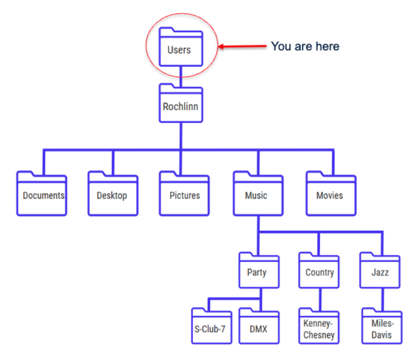

## File and Directory Paths

* [Download the PowerPoint](files/Block4-1_File-Paths.pptx)

<object class = "pdf" data = "files/Block4-1_File-Paths.pdf"></object>

 

### Exercise

1. What's the path to the Music directory?

2. What's the path to the S-Club-7 directory?

Enter your answers in Padlet: <a href="https://padlet.com/nickrochlin/file-path-exercise-kafxid57o9s092re">File Path Exercise</a>

