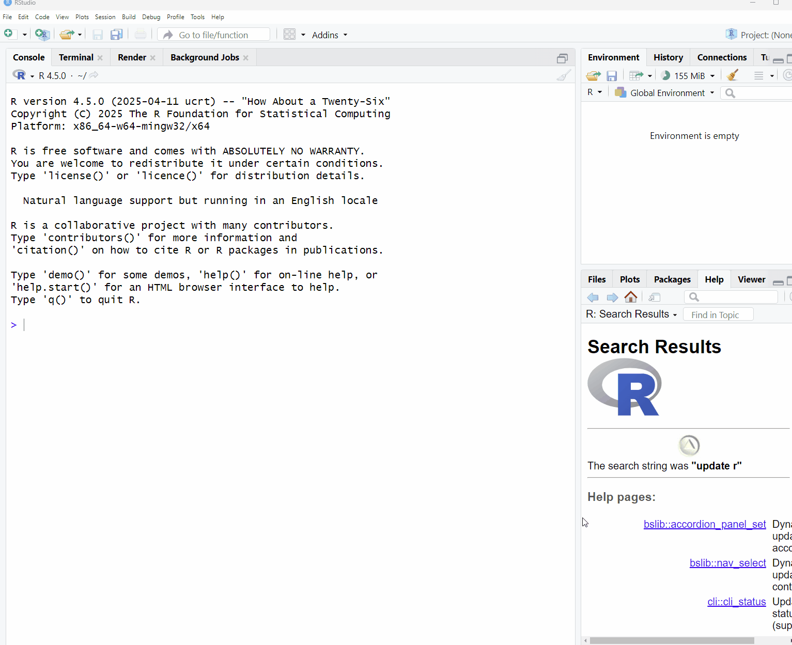

```{r setup, include=FALSE}
knitr::opts_chunk$set(message = FALSE, warnings = FALSE)
```

## Introduction

:::intro
Now that we've familiarized ourselves a bit with R and RStudio, we can start moving forward to working with data in R, which is where the real fun begins!
:::

In this session, we will:

* Discuss the Tidyverse and its utility in the data science workflow
* Introduce packages and libraries in R, and then install and load the Tidyverse
* Identify how to import datasets into R
* Describe techniques to explore datasets in R
* Recode column names in a dataset

## Packages and Libraries

When you first download R, it comes equipped with a number of pre-installed functions, or capabilities, that you can start using immediately.  This is often called "Base R:.  However, for certain tasks and workflows, it can be beneficial to use more specialized tools, or functions, to accomplish work and facilitate workflows for efficiently.  This is where packages and libraries come into play.

:::note

* **Packages**: Packages are an extension of the pre-built functions in R, and can be installed to bring in specific functions to accomplish tasks, bring in sample datasets to play with, among other things.  There are **tons** of R packages out there, but here is a list of some of the most common/useful ones: [Quick list of useful R packages](https://support.posit.co/hc/en-us/articles/201057987-Quick-list-of-useful-R-packages)

* **Libraries**: Once you have installed a package, they are stored as libraries in R.  You only have to install them once, and anytime you want to use the package you can use the `library()` function, which is described below.

:::


### Tidyverse

As mentioned in the session **"Reproducible Research: Moving From Excel to Scripting"**, we will be using an R package called the **"Tidyverse"**.  The Tidyverse is a very commonly used package for research and data science activities, and instead of being a single package, it is a collection of packages that are designed to work together and which focus on the connections between activities in the data science workflow.  Each package follows the same syntax, which makes learning them easier, and the website functions as a really good reference point if you're struggling with how to approach a specific task.


Let's take a closer look!  [Tidyverse](https://www.tidyverse.org/packages/)

<br>

## Let's get started!

First, let's create a new R script.

To create an R script file, select File > New File > R Script




### Install Package
To install a package we use the function `install.packages()`. 

```{r}
#install.packages("tidyverse")
```

### Load Libraries
Packages are stored in libraries. Once a package is installed, we need to call the library with the function `library()`.

```{r}
library(tidyverse)
```

:::flag
Note that the package name needs to be in quotations when installing the package, but not when loading the library.

Because packages only need to be installed once, we can do this in the R console as opposed to in the script.

Because libraries need to be loaded in each working session, we can do this in the R script so that others can see what libraries we are using and need to be loaded.
:::


Referring again to the Tidyverse Data Science Workflow, in this session we'll be focusing on the first two steps:


<a href="https://telapps.london.edu/analytics_with_R/tidyverse.html">Source</a>

## Reading Data

In order to start working with a dataset in R, we first need to import, or "read in", the data.  As mentioned in the session **"Reproducible Research: Moving From Excel to Scripting"**, we will be working with `.csv` files, but R is capable of reading in other file types as well.


### Read a csv file
To import a csv file we can use the `read_csv()` function and assign it to a new object we will call *js_data*. We create a new object to be able to call it in different functions later on.
```{r}
js_data <- read_csv("data/timeuse_block-4_first-steps.csv")
```

### Read Other Formats
In the example we are working with the data is stored in a csv file. The package **readr** from Tidyverse can also read other formats like `read_tsv()`(tab-separated values), `read_delim()`(delimited files CSV and TSV), `read_table()`(whitespace-separated files), `read_log()`(web log files).

There are other functions and packages that allow us to import different file types. 

**File Type** |**Function** | **Package**
|:------|:------|:-------|
|.csv | `read_csv()`| readr |
| .xlsx | `read.xlsx()`| xlsx |
| .sav | `read_sav()`| haven |
| .sas7bdat , .sas7bcat | `read_sas()`| haven |
| .dta | `read_dta()`| haven |

## Listing Column Names
To ask for a list of all the column names in our dataset we can use the `names()` function.
```{r}
names(js_data)
```

Notice that the column names from the original dataset don't provide a clear description of what the variable is. We will change the column names later to facilitate working with our data in the future.

## Head Function
The head function will display the top rows of the dataset. It will include information about the default data type assigned to each column. You will learn more about data types tomorrow.

```{r, data-isolation, results = FALSE}
head(js_data)
```

```{r, echo = FALSE, message = FALSE, warning=FALSE}
library(kableExtra)
head(js_data)|>
  kbl() |>
  #kable_styling(bootstrap_options = "striped")
kable_paper() %>%
  scroll_box(width = "500px", height = "200px")

```

## Viewing Data
To visualize the full dataset we use the `View()` function. This will open our dataset in a separate window.
```{r, eval=FALSE}
View(js_data)
```


## Change Column Names
We mentioned earlier that we wanted to work with column names that were more descriptive of the content of each variable. To change column names we can use the function `rename()`.

The function `rename()` is part of one of the packages that was installed with tidyverse.

:::walkthrough
Type the following code to change the column name from "PUMFID" to "id"
```{r}
js_data <- js_data |>
  rename ("id" = "PUMFID")
```
Did it work?
:::

## Your Turn!

:::question
First, use the function`names()` to display the column names.
```{r, eval=FALSE}
names(js_data)
```
:::

:::question
Now, see if you can change the `AGEGR10` column name to `ageGrp`
```{r, class.source = 'fold-hide'}
js_data <- js_data |>
  rename ("ageGrp" = "AGEGR10")
```

:::

:::question
Next, try to change the following 3 column names:

* Change `SEX` to `sex`
* Change `MARSTAT` to `maritalStat`
* Change `PRV` to `province`

**Hint:** It can be tedious to do these changes one by one, but by using commas `,` you can rename column names with a single code chunk.  
```{r, class.source = 'fold-hide'}
js_data <- js_data |>
  rename ("sex" = "SEX",
          "maritalStat" = "MARSTAT",
          "province" = "PRV")
```
:::

:::question
Now, to change the rest of the column names copy the following code. (If you feel you're starting to understand how this works, you can show the code below and `cope + paste` it into your script, or if you want some more practice, feel free to do it yourself!

```{r, class.source = 'fold-hide'}
js_data <- js_data |>
  rename ("popCenter" = "LUC_RST",
          "eduLevel" = "EHG_ALL",
          "feelRushed" = "GTU_110",
          "extraTime" = "GTU_130",
          "durSleep" = "DUR01",
          "durMealPrep" = "DUR05",
          "durEating" = "DUR06",
          "durAlone" = "DURS200",
          "durDriving" = "DURL313",
          "durWork" = "DUR08",
          "durShoolSite" = "DUR13",
          "durSchoolOnline" = "DUR14",
          "durStudy" = "DUR15",
          "mainStudy" = "MRW_20",
          "mainJobHunting" = "MRW_30",
          "mainWork" = "MRW_40",
          "worked12m" = "MRW_D40A",
          "workedWeek" = "MRW_D40B",
          "enrollStat" = "EDM_02",
          "dailyTexts" = "TST_01",
          "timeSlowDown" = "TCS_110",
          "timeWorkaholic" = "TCS_120",
          "timeNotFamFriends" = "TCS_150",
          "timeWantAlone" = "TCS_200")
```

:::

## Save Your Work


Now that we've created a dataset that has some significant changes, it can be helpful to save this as a version that we can easily return to.  Much like we did with reading `.csv` data into R, there is a similar command to save, or "write" `.csv` data back to your computer called `write_csv()`.  The syntax is as follows:

`write_csv(data-object-name, file="file-path/datafile-name.csv")`

The file name below is for example purposes, and feel free to use a file naming convention that you developed:

```{r}
write_csv(js_data, file="data/timeuse_clean-cols.csv")
```

<br>

An additional way to save data files in R is as an `.Rdata` file.  Unlike a simple `.csv` file, `.RData` files are designed to store R objects and your entire R workspace, while maintain their data types and structures (covered in the next session!).  This allows you to return to your R environment exactly as you left it when you reload the file, and allows others opening your files to have that environment as well, acting as a great way to faciliate reproducibility.

The syntax is similar is the same as `write_csv`, but uses the function `save()`:

```{r}
save(js_data, file="data/timeuse_clean-cols.RData")
```

<br>

:::note
When opening an `.RData` file, instead of using `read_csv()`, you use the `load()` command.  The syntax is the same, and to reopen the file you just saved would look like this:
```{r, eval = FALSE}
`load("data/timeuse_clean-cols.RData")`
```


:::


