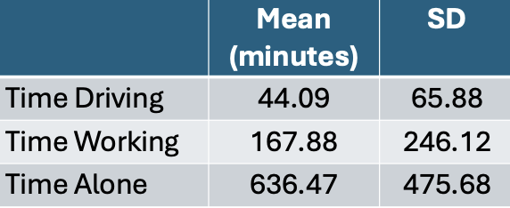

```{r, libraries, include = FALSE}
library(kableExtra)
library(ggplot2)
library(dplyr)
```

```{r setup, include=FALSE}
knitr::opts_chunk$set(echo = TRUE, message = FALSE, warnings = FALSE)
```


## Data Visualization in R

:::intro
Data visualization is an important part of exploring, understanding, and sharing our data.
:::

Data visualization is a critical part of the data science workflow. Through visualization we can explore and understand our own data, ultimately informing further analyses. Additionally, data visualizations are a powerful tool for communicating data and research findings to other people. Visuals can often more efficiently and more effectively tell the story of your data, rather than only relying on writing. Well done data visualizations will often have the biggest impact on an audience in a science communication context. 


[Source](https://telapps.london.edu/analytics_with_R/tidyverse.html)


Let's get started! 

### Types of Data Visualization

Data visualizations can be descriptive in nature, such as portraying the demographic distribution of a group of people, or can represent statistical findings, such as a regression line with a confidence interval overlaid on a scatter plot of data. In certain contexts it is also common to present data and information in more easily digestible infographics <a href="https://coolinfographics.com/">(check out some examples here)</a> that enter more of a graphic design space. Different data visualizations fulfill different goals. Having a toolbox of a variety of data visualization types can help you pick the best type to fit your needs for a given project. 

#### **Table**
Tables to collect and organize data are one of the most common and basic data visualizations. But don't discount them! They can be efficient ways to convey a large amount of information about your data all at once. 



#### **Pie Chart**
A classic pie chart is useful for representing parts that add up to a whole. This also allows for comparing group sizes. They are often used for demographic variables, with the whole representing the whole sample, or for representing money, with the whole representing a budget or total money spent/made. Be careful to use a pie chart only when it really adds to the story. For instance, if there are only two parts to the whole, a pie chart might not convey much more information. Conversely, if there are many groups, it can become difficult to really see all of them and compare them. 


#### **Box Plots**
Box plots (also known as box and whisker plots) are good for understanding and comparing variance between groups. They typically depict the median and minimum/maximum of each group for a certain variable. The box portion represents the 1st and 3rd quartiles of the distribution. You can also show change over time with this type of plot. 

```{r, echo = FALSE}
ggplot(js_data, aes(x=as.factor(province_fact), y=durSleep)) + 
    geom_boxplot(fill="#2D5E7F", alpha=0.6) + 
    xlab("Province") +
    ylab("Minutes Sleeping") +
 theme(text = element_text(size = 18))
```

#### **Histogram** 
Histograms display the distribution of one variable. The height of the bar represents how many times that value was represented in the data. This is typically what you view if you want to visually inspect if a variable is normally distributed. 

``` {r, echo = FALSE}

ggplot(js_data, aes(x=durSleep)) + 
  geom_histogram(fill = "#2D5E7F", color = "black")+
  xlab("Number of Minutes Sleeping") +
  ylab ("Number of Participants") +
  theme(text = element_text(size = 18))
```

#### **Bar Chart** 
Bar charts are good for representing data from groups or categories, with the bars representing different categories. The bar height usually represent a mean, a count, or a percentage, by category. These can be useful for comparing groups or showing change over time. 

``` {r, echo = FALSE}
ggplot(js_data, aes(x=maritalStat_fact, fill = as.factor(maritalStat_fact))) +
  geom_bar() + 
  xlab("Marital Status") +
  ylab ("Number of Participants") +
  scale_fill_hue(c = 60) +
  theme(legend.position = "none",
        text = element_text(size = 18),
        axis.text.x = element_text(angle = 35, hjust = 1))
```

#### **Scatter Plot** 
Scatter plots include data points that are plotted along an x and y axis, showing the relationship between these two variables. Often researchers add a line to these plots to show the statistical relationship between the variables. 

```{r, echo = FALSE}
ggplot(js_data, aes(durWork, durSleep)) +
  geom_point(color = "#2D5E7F", alpha = .2) +
  geom_smooth(method=lm, se=TRUE, color = "black") +
  xlab("Minutes Spent Working") +
  ylab ("Minutes Spent Sleeping") +
  labs(title = "Association Between Working and Sleeping") +
  theme(text = element_text(size = 18))
```

#### **Line Chart** 
Line charts use connected straight lines to display data. They are good for showing change over time on a continuous variable. They are often similar in purpose to bar charts, but visually simpler if there are many time points. An example of where we often see line charts used in the news is to visualize the stock market. (Plotting the various age groups here is not particularly meaningful since this data was only collected at one time point, but is used to illustrate this type of data visualization.)

```{r, echo = FALSE}
xValue <- 1:7
yValue <- c(1303, 2127, 2597, 2789, 3741, 2958, 1875)
plotdata <- data.frame(xValue,yValue)

ggplot(plotdata, aes(x=xValue, y=yValue)) +
  geom_line(color = "#2D5E7F") +
  xlab("Age Groups") +
  ylab ("Number of Participants") +
  labs(title = "Number of Participants per Age Group") +
  theme(text = element_text(size = 18)) +
  scale_x_continuous(breaks = seq(1, 7, 1)) +
  scale_y_continuous(breaks = seq(0, 4000, 500))

```

#### **Interactive Data Visualizations** 
As research and publications move more online and away from print, this can allow for more interactive data visualizations. These are types of data visualizations that allow a person to select and change what is being shown. Check out this great example from <a href="https://www.gapminder.org/tools/#$chart-type=bubbles&url=v2)">Gapminder</a>. The default visualization shows GDP and life expectancy over time, and by country. However, you can change the variables included to view other data. 

#### **So many more!** 
- Heat Map
- Stacked Bar or Stacked Area Chart
- Violin Plot
- Gantt Chart
- Choropleth Map

### What Makes a Good Visualization?
There is an art to picking the best data visualization that fits your data and the story you are telling. By nature, data visualizations are abstract representations of our data, with color, shape, and position representing the data points. This both hides the exact data itself, while also allowing us to highlight bigger picture ideas about the data, depending on what we choose to emphasize. When deciding on what type of data visualization to use, consider the following: 

- What question are you exploring with your data and how will it inform future analyses?
- What is your data visualization adding to your science communication? 
- What take-away message are you conveying with the image? 
- What type of variables do you have? Continuous? Categorical? And what type of abstraction (e.g., color, shape) best suits that variable?
- Are you comparing groups?
- Are you showing change over time?
- Are you visualizing a relationship between variables?

It can be easy to get in the habit of using the same types of data visualization over and over again. Check out this website that gives many creative data visualization options (with R code!), categorized by goal: <a href="https://r-graph-gallery.com/ ">https://r-graph-gallery.com/ </a>

#### Good Data Visualization Princicples

Once you pick the format that fits your needs best, these are some principles to keep in mind when crafting your visualization to make sure it is clear to your audience.

:::md-table
| Principle | Considerations |
| :--- | :--- |
| Clear Data | Consider the format of your data when you include it. Your data needs to be unambiguously communicated to your audience. For instance, do you have so many groups that they are difficult to differentiate? Are your data points stacked on the same spot so the audience can't see the density of your data points? |
| Clear Labels | All data visualizations need labels. This may be the axis on a scatter plot, legends for your bar graph, or percentages on your pie chart. You must tell the audience what they are looking at. If different colors are used, they should represent some aspect of the data and be clearly labeled. |
| Clear Scales | Clear and consistent scales are important to avoid misinterpretation of your data visualization. An axis should be clearly labeled and include the full scale range. Make it clear if the scale does not start at 0. Scales should be consistent across visualizations to allow for comparisons. |
| Simplicity | Aim to have uncluttered data visualizations. It is easy to get excited about all you can do creatively in the world of data visualizations, but sometimes adding too much (e.g., extra colors, pictures) can actually obscure your main message. Avoid extra info that doesn't add to the story you are telling. |
| Accessibility | Consider how your data visualization design would be viewed by a variety of people. Text font and size for legends and axis labels should be clear and not too small. Try not to rely only on color to distinguish groups (e.g., lines can be dashed or dotted), or pick colors/hues that are distinguishable by people who are colorblind. Include alternative text descriptions that can be read aloud by a screen reader. |
:::

For more information on design principles and the visual hierarchy of elements, check out <a href="https://www.interaction-design.org/literature/topics/visual-hierarchy?srsltid=AfmBOooU77XPiVsXSkE7t2GqAayaOyh0VxdwGj3bJaP1Qj3xcc5A44BW">this article</a>. Size, color, contrast, alignment, repetition, proximity, whitespace, and texture can all be used to draw focus to particular visual elements. 


### Your Turn!
One of the best ways to get into data visualization is to get inspired from some of the amazing data visualizations that already exist! 

We have two websites with a variety of data visualization examples. 

- <a href="https://r-graph-gallery.com/best-r-chart-examples">R Graph Gallery</a>
Includes many examples of data visualizations created in R. These also include tutorials/R Code used to make them. These examples go beyond what we will cover in this workshop, but serve as great inspiration for how much you can do in R!

- <a href="https://www.tableau.com/viz-gallery">Tableau Viz Gallery</a>
Includes examples created with the platform Tableau. This is a proprietary (paid) platform which we are not using in this workshop, but this gallery still has some great examples to help inspire your data visualization creativity! 

:::question
In small groups, on either of these websites, find a data visualization example that jumps out to you as interesting and then answer the following questions. 

1. What captured your attention about this data visualization? The topic? The design? 
2. What is the story this example is trying to tell? What is one of the take-away messages it is conveying?
3. What do you like about this visualization? Does it convey information about the data in a uniquely effective way? Does it adhere to the principles we discussed? 
4. Is there anything you find confusing about this example? Anything you think is missing or that you would change to improve it? 
:::
