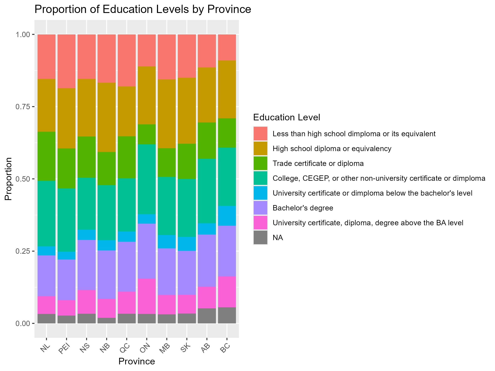

```{r, libraries, include = FALSE}
library(kableExtra)
library(ggplot2)
library(dplyr)
```

```{r setup, include=FALSE}
knitr::opts_chunk$set(echo = TRUE, message = FALSE, warnings = FALSE)
```


### Visualizations with ggplot2

Now that we have our data visualization imaginations going, let's get into how we can visually represent our data in R.

The go-to package for data visualization in R is `ggplot2`, which is part of the tidyverse. You can find more information about `ggplot2` on the <a href="https://ggplot2.tidyverse.org/">tidyverse website</a>.

This package approaches data visualization through "a grammar of graphics." In other words, using the same syntax, you can create an infinite number of data visualizations. Although there are a lot of functions and components to learn at first, once you understand the overall structure of building graphics in `ggplot2`, you can replicate and expand on this structure to visualize data in an unlimited number of ways. 

### Create a New Script

Let's start by creating a new script.


If you have installed the tidyverse, then `ggplot2` is included. Otherwise you can install it now. Let's also load our dataset for today.

```{r}
#install.packages("ggplot2")
#library(ggplot2)
```

:::note
Let's also load our dataset.  For this exercise, we are using a dataset that is exactly the same as the one that was produced in the session **Data Types and Structures**, but that has one extra variable added called `isFeelRushed`.  This variable is derived from the `feelRushed` variable, with the number `1` indicating that somebody feels rushed, and `0` indicating they do not feel rushed.  For more information on this variable and how it was created, see the session [R: Filter and Select](https://alliance-rdm-gdr.github.io/rdm-jumpstart/3-ACT-3-FilterSelect.html)

:::

```{r}
load("data/block-5_visualization.RData")
```

There are many ways to make data visualizations in R; however, other approaches tend to be more automatic and consequently limit the amount you can change and adapt your visualization to your needs. `ggplot2` works in layers, allowing for maximum control and flexibility. 

Here are some of the most common layers (i.e., functions) used in `ggplot2`. Typically you connect these layers using the `+` symbol. There is often more than one way to build the same plot with the `ggplot` package. 

**- `ggplot()`:** how you will start most plots you build in `ggplot2`. The rest of the information goes within this function.

**- `aes()`:** this is the aesthetic mapping function, in which you can control aesthetic components of the plot. You can add colors, axis labels, font sizes and more within this function. Color and shape can be defined both within and outside of the aesthetic function. 

**- `geom_point()`:** used for making a scatter plot

**- `geom_line()`:** used for adding a line to a plot

**- `geom_histogram()`:** used for making a histogram

**- `geom_col()`:** used for making a bar plot

**- `xlab`, `ylab`, and `labs(title = )`:** used for adding axis labels and an overall title to plots

**- `color`:** assigns a color to part of the plot, such as different groups or the data points

**- `fill`:** assigns the interior color of part of the plot, such as a confidence band or the bars in bar plots

**- `alpha`:** used to change the transparency of a component of the plot. Useful if you lots of have overlapping data points or distributions from multiple groups. 

**- `size`:** used to set the size of part of the plot, such as how big the data points or text should be

There are many more data visualization options in `ggplot` but to get started today we are going to focus on making a bar plot (good for categorical data) and a scatter plot (good for continuous data). 


### Basic Bar Plot: Counts
Let's make our first plot in R! We are going to slowly add layers, building up to a box plot representing the number of people in each group in the `isFeelRushed` variable.

When creating visualizations, it's always good to have a sense of the variables you're working with.  It can be helpful to use the `View()` command we discussed in the session **First Steps in R**:

```{r, results = 'hide'}
View(js_data)
```

It can also be helpful to have the data dictionary handy, so you know each variable's data type and description:

```{r, echo=FALSE, out.width="95%", out.height="500in"}
    knitr::include_graphics("images/Block4-2_Dictionary.pdf")
```

<br>

First we create the blank plot on which we will add our data. We nearly always start with the function `ggplot` and then telling the function what dataset to use. 

```{r}
ggplot(js_data)
```

This creates our blank canvas.

Next we tell ggplot what variable we want to use and put it in the `aes()` function. If you want a bar chart representing the number of people in each group, you can add just one variable to the `aes()` function. We include the `as.factor` function around the `isFeelRushed` variable so it is treated as a categorical variable for the box plot instead of a numeric variable. 

```{r}
ggplot(js_data, aes(x = as.factor(isFeelRushed)))
```

You now see that the grid represents a scale relevant to that variable. 

Next, we tell ggplot what type of data visualization we want. To create a bar chart we use the function `geom_bar()`. To see how many people are in each of the `isFeelRushed` groups, we use the default `geom_bar(stat = "count")`. Remember that we connect layers with a `+` symbol. 

```{r}
ggplot(js_data, aes(x = as.factor(isFeelRushed))) +
  geom_bar(stat = "count")
```

We've got a bar chart!

Lastly, let's add some labels to the x-axis and y-axis to make it clear what is being plotted. 

```{r}
ggplot(js_data, aes(x = as.factor(isFeelRushed))) +
  geom_bar(stat = "count") + 
  xlab("Feeling Rushed") +
  ylab ("Number of Participants") 
```

### Basic Bar Plot: Group Means

Now, let's see if people who feel rushed tend to work more than people who do not feel rushed. To represent the mean for each group or some other variable, you add both an x and a y variable to the `aes()` function and use the `geom_bar(stat = "summary")`. Note that the Y-axis scale has now adjusted to a scale that matches the variable we are using (i.e., mean number of minutes spent working for each group). 

```{r}
ggplot(js_data, aes(x = as.factor(isFeelRushed), y = durWork)) +
  geom_bar(stat = "summary") + 
  xlab("Feeling Rushed") +
  ylab ("Average Minutes Working") 
```

:::walkthrough
  - Most plots will start with the `ggplot()`function
  - You have to include the object where `ggplot()` will get the information for the plot from. In this case, it's our dataset `js_data`
  - Within the `aes()` function, we identify what the x and y variables are for this plot
  - We add layers using the `+` sign
  - Next we tell `ggplot()` what type of plot we are making; in this case we are creating a bar plot using the function `geom_bar()`
  - Then we add what type of statistic we want presented on the plot. Here we ask for the mean of each group for the variable durWork using the function `geom_bar(stat = "summary")`
  - We add a label to the x-axis with `lab("Feeling Rushed")`
  - We add the label to the y-axis with `ylab ("Time Working")`
  
:::

### Improved Box Plot! 
This plot gets the idea across, but we can add more layers and functions to make more adjustments. See the walkthrough below for how we made all these changes.

```{r}

plotlabels <- c("Not Rushed", "Rushed", "Did Not Respond")

ggplot(js_data, aes(x = as.factor(isFeelRushed), y = durWork)) +
  geom_bar(stat = "summary", fill = "#2D5E7F") + 
  xlab("Feeling Rushed") +
  ylab ("Average Minutes Working") +
  labs(title = "Working and Feeling Rushed") +
  scale_x_discrete(labels = plotlabels) +
  theme(text = element_text(size = 18),
        axis.text.x = element_text(angle = 25, hjust = 1))
  
```

:::walkthrough
  - We can change the color of the bars using `fill = `. Here we added the specific color using a hex code. But you can also write in the names of colors such as "blue".
  - Using `labs(title = "")` we added an overall title to the plot
  - We probably want to indicate what each category represents, rather than the "0", "1" and "NA" labels. To add text labels, we first create an object with each of those labels in order (`plotlabels <- c("Not Rushed", "Rushed", "Did Not Respond")`). Then in the `scale_x_discrete(labels = plotlabels)` function we call to that object we created as the labels for the x-axis. There are many other ways to adjust the labels for each axis, but this method works well for a small number of groups.
  - In the `theme()` layer you can add many different specifications. Here we added `text = element_text(size = 18)` to make the text size bigger than the default and made the x-axis labels angled so they fit better using `axis.text.x = element_text(angle = 25, hjust = 1)`. The `hjust = ` adjusts the vertical location of the axis labels so they don't overlap with the plot itself. `vjust = ` can be used to move the labels right and left. 
  
:::

:::question
Try manipulating this plot in some way. Can you change the color of the bars? What happens if you change `angle = 90`?
:::

### Basic Scatter Plot
Now let's make a scatter plot to visualize two continuous variables. We are going to check if it looks like there is a correlation between how much time people work (durWork) and how much they sleep (durSleep).

```{r}
ggplot(js_data, aes(durWork, durSleep)) +
  geom_point() +
  geom_smooth() +
  xlab("Minutes Spent Working") +
  ylab ("Minutes Spent Sleeping")
      
```

:::walkthrough
  - Again we start with the `ggplot()` function, including telling it to use the dataset `js_data`
  - In the `aes()` function we list the x and y variables (here durWork and durSleep)
  - The `geom_point()` function is what makes a scatter plot
  - The geom_smooth() is what adds the correlation line to the plot
  - The `xlab()` and `ylab()` add the x-axis and y-axis labels to the plot
  
:::
### Improved Scatter Plot!

Now let's add some layers and aesthetic adjustments to improve this plot.

```{r}
ggplot(js_data, aes(durWork, durSleep)) +
  geom_point(color = "#2D5E7F", alpha = .2) +
  geom_smooth(method = lm, color = "black") +
  xlab("Minutes Spent Working") +
  ylab ("Minutes Spent Sleeping") +
  scale_x_continuous(breaks = seq(0, 1500, 250)) +
  labs(title = "Association Between Working and Sleeping") +
  theme(text = element_text(size = 18))
```

:::walkthrough
  - We can change the color of the data points by adding `color = "#2D5E7F"` and change the transparency of the data points (so you can see where there are overlapping clusters) with the addition of `alpha = .2`. 
  - In the `geom_smooth()` function we changed the method for calculating the line to be linear (instead of the ggplot default) using `method = lm` and adjusted the color of the line with `color = `. Remember that you can write hex code numbers or the names of colors to adjust colors. Make sure both are in quotes to avoid error messages. 
  - We adjust the x-axis tick marks with the `scale_x_continuous(breaks = seq(0, 1500, 250))` part, which tells R to plot the x-axis on a sequence from 0 to 1500 (this captures all of the responses in our data), with labels every 250 minutes. 
  - The `labs(title = "Association Between Working and Sleeping")` adds an overall title to the plot
  - Lastly, `theme(text = element_text(size = 18))` adjust the text size
  
:::

:::question
Try manipulating this plot in some way. Can you make the data points more and less transparent? Can you change the color of the line? What happens if the x-axis has labels every 100 minutes?
:::

### Your Turn!

:::note

For the following questions, the goal is to get you thinking about the building blocks that go into making a visual.  Don't get too focused on the finished product right away, and try to think about the individual steps needed to get you to there.  As with any coding task, it can be very helpful to think of or write each of the steps down in plain English, then work through each one.  

As a final note, a **huge** part of learning how to code is using search engines, and there is a ton of documentation out there to help you.  This also relates back to putting things into plain-language steps, because being able to clearly articulate your goals is synonymous with using good search terms.

The data dictionary will also be an asset in working through this exercise:

```{r, echo=FALSE, out.width="95%", out.height="500in"}
    knitr::include_graphics("images/Block4-2_Dictionary.pdf")
```

Good luck!

:::


::: question
Take a look at our data set and make two new plots. 

1. Make a plot comparing groups (i.e., a categorical variable) on one of the duration variables (i.e., a continuous variable).

2. Make a plot comparing two continuous variables. 
:::

::: question

**Challenge:** What is one component of your plot you would like to change? Can you look up a solution? 
:::


:::question
See if you can recreate the plot below.  
<br>
**Hint:** First try to recreate the plot with NA values.  Then, to remove `NA` values from the plot, you will need to use both the `na.omit` and the `na.rm = TRUE` commands.


```{r echo=FALSE, fig.align='center'}
knitr::include_graphics("images/block5-2_time-alone.png")
```

```{r class.source = 'fold-hide', results = 'hide'}
time_alone_plot <- ggplot(na.omit(js_data), aes(x = factor(timeWantAlone), y = durAlone)) +
  geom_boxplot(fill = "blue", na.rm = TRUE) +
  scale_x_discrete(labels = c(
    "1" = "Would like more time alone",
    "2" = "Do not want more time alone"
  )) +
  labs(
    title = "Distribution of Time Spent Alone by Desire to Be Alone",
    x = "Desire to Spend Time Alone",
    y = "Duration Spent Alone - Minutes"
  )
```

:::

:::question
See if you can recreate the plot below.

<br>

**Hint:** This type of chart is called a "proportional bar chart", and search engines are your best friend!

```{r echo=FALSE, fig.align='center'}

```

```{r class.source = 'fold-hide', results = 'hide'}
prov_edu_plot <- ggplot(js_data, aes(x = province_fact, fill = eduLevel_fact)) +
  geom_bar(position = "fill") +
  labs(
    title = "Proportion of Education Levels by Province",
    x = "Province",
    y = "Proportion",
    fill = "Education Level"
  ) +
  theme(axis.text.x = element_text(angle = 45, hjust = 1))
```

:::

## Save Your Work

We didn't make any changes to the data in this session, but we did create a new R script.  Save that script and back it up to OSF.


## Update Documentation

We've added a new file to our project, so we'll also need to update the README document to reflect this.


