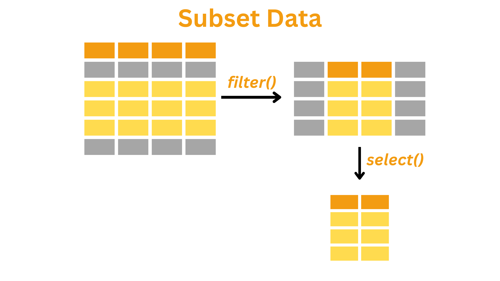

## Overview

------------------------------------------------------------------------



## Introduction

<h4 style="text-align:left;">

<strong>Subsetting data is an essential part of the <em>transform</em> stage in the data science workflow. It involves extracting a portion of the dataset based on specific conditions.</strong>

</h4>

In this short tutorial, we will learn:

1.  What subsetting means and why it is crucial
2.  How to perform subsetting using conditional operators and the dplyr functions `filter()` and `select()`

------------------------------------------------------------------------

<h4 style="text-align:left;">

Why is subsetting a dataset important?

</h4>

::: note
Most real-world datasets are large and complex, with many variables and thousands of records.
:::

Most real-world datasets are large and complex, with many variables and thousands of records. Analyzing all of it at once can introduce noise, slow down computation, and make it harder to detect meaningful patterns. By filtering rows and selecting specific columns, we reduce this complexity, improve clarity, and can more efficiently test hypotheses or build models. Subsetting also plays a key role in ensuring data quality, allowing us to remove irrelevant or problematic entries like missing values, outliers, or categories outside the scope of our analysis.

::: note
Filtering rows and selecting specific columns helps us:

-   Reduce dataset complexity and improve clarity, making it easier to test hypotheses efficiently
-   Remove irrelevant or problematic entries such as missing values, outliers, or unused categories, improving overall data quality
:::

::: flag
The original dataset is very large---it includes 848 variables and 17,000+ observations.
:::

The dataset we have used in previous sessions originated from the [General Social Survey, Cycle 29 (2015)] (https://odesi.ca/en/details?id=/odesi/doi__10-5683_SP3_RDS0CK.xml), from the Social and Aboriginal Statistics Division at Statistics Canada. This survey tracks how Canadians spend and manage their time, helping us understand patterns tied to well-being and stress. However, the original dataset is very large---it includes over 848 variables and more than 17,000 observations.

For the purposes of this tutorial, we are not interested in every variable. Instead, we are working with a **subset** of this dataset: 29 variables focused mainly on time durations and key demographic characteristics. This makes the data more manageable and relevant for our exploration of time use and perceptions of time pressure.

------------------------------------------------------------------------

<h4 style="text-align:left;">

Framing the Guiding Question: Who Feels Rushed?

</h4>

<!-- ### Framing the Guiding Question: Who Feels Rushed? -->

Let's return to the time usage dataset. In this section, suppose we're interested in understanding how people who feel rushed spend their time differently from those who don't. To answer this question, we don't need every single row or column, as working with the data in its original format would be unnecessarily complex. Instead, we need to "get inside" our data by subsetting: filtering the rows and selecting the columns that matter.

We will explore our dataset through one guiding question:

**How do people who feel rushed spend their time differently from those who don't?**

We'll focus on the relevant rows and columns that answer this question.

------------------------------------------------------------------------

## Step 0: Setup and Load the Data

------------------------------------------------------------------------

```{r setup, include=FALSE}
knitr::opts_chunk$set(echo = TRUE, message = FALSE, warning = FALSE)
```

<h4 style="text-align:left;">

Load and Understand the Dataset

</h4>

<!-- ### Load and Understand the Dataset  -->

First, we need to load the necessary libraries for this session.

```{r, data-isolation-15, results = 'hide', echo=FALSE}
library(kableExtra)
```

```{r, libraries}
library(dplyr)
```

In our subsequent tasks, the `dplyr` package will be essential for subsetting operations such as filtering rows and selecting columns. We can either continue using the `js_data` object from the previous section or load the `timeuse_day3_1.Rdata` file from the data folder.

```{r}
load("data/timeuse_clean-cols_recoded.RData")
```

Now, let's again examine our dataset structure by displaying the first few rows by using `head()` function.

```{r, data-isolation-1, results = 'hide'}
js_data |>
  head()
```

```{r, echo=FALSE}
js_data |>
  head() |>
  kbl() |>
  kable_styling(bootstrap_options = "striped") |>
  scroll_box(width = "100%")
```

As we can see, there are 30 columns in the dataset, which is a lot to work with. For now, we can focus on the following key columns:

-   `id`: Record identification
-   `ageGrp`: Age group of respondent (groups of 10)
-   `sex`: Sex of respondent
-   `maritalStat`: Marital status of the respondent
-   `province`: Province of residence
-   `popCenter`: Population centre indicator
-   `eduLevel`: Educational attainment (highest degree)
-   `feelRushed`: General time use -- Feel rushed
-   `extraTime`: General time use -- Extra time
-   `durSleep`: Duration -- Sleeping, resting, relaxing, sick in bed
-   `durWork`: Duration -- Paid work
-   `timeWorkaholic`: Perceptions of time -- Workaholic
-   `timeWantAlone`: Perceptions of time -- Would like more time alone

These columns provide information on demographics, time usage, and time perceptions. We can use them to explore patterns in work-life balance, education, and social time.

Now that we understand our dataset structure, let's move on to learning how to filter and manipulate this data effectively using Boolean operators in `dplyr`.

------------------------------------------------------------------------

## Step 1: Learning About Filtering

------------------------------------------------------------------------

<h4 style="text-align:left;">

Conditional Filtering with Boolean Operators using <strong>dplyr</strong>

</h4>

<!-- ### Conditional Filtering with Boolean Operators using **dplyr** -->

`dplyr` is a powerful package that lets us extract and transform data with a clear, readable syntax. In `dplyr`, we use functions like `filter()`, `select()`, and `mutate()` to work with our data. Boolean operators (`==`, `<`, `>`, `<=`, `>=`, and `!=`) are used within these functions to test conditions, and we can combine conditions with `&` (and) or `|` (or).

Let's start by understanding the basic comparison operators that will help us create filtering conditions.

#### **Comparison Operators**

Comparison operators allow us to check conditions within our dataset. These return `TRUE` or `FALSE` based on whether the condition is met.

| Operator | Meaning                  | Example  | Result |
|----------|--------------------------|----------|--------|
| `==`     | Equal to                 | `5 == 5` | `TRUE` |
| `!=`     | Not equal to             | `5 != 3` | `TRUE` |
| `<`      | Less than                | `3 < 5`  | `TRUE` |
| `>`      | Greater than             | `5 > 3`  | `TRUE` |
| `<=`     | Less than or equal to    | `3 <= 3` | `TRUE` |
| `>=`     | Greater than or equal to | `5 >= 3` | `TRUE` |

Once we understand these basic comparison operators, we can combine them using logical operators to create more complex filtering conditions.

#### **Logical Operators**

Logical operators allow us to filter data based on multiple conditions.

| Operator | Meaning                                          | Example             | Result  |
|-------------|---------------------------------|--------------|-------------|
| `&`      | Logical AND (Both conditions must be TRUE)       | `(5 > 3) & (4 < 6)` | `TRUE`  |
| `|`      | Logical OR (At least one condition must be TRUE) | `(5 > 3) | (4 > 6)` | `TRUE`  |
| `!`      | Logical NOT (Reverses TRUE/FALSE)                | `!(5 > 3)`          | `FALSE` |

Let's try using these logical operators to filter the rows in the following example.

We want to understand whether feeling rushed might relate to how much time is spent on work, sleep, or alone time. Therefore, the columns of interest are `feelRushed`, `durSleep`, `durWork`, and `durAlone`. First, let's explore the values in these columns using `dplyr`.

Let's look at the unique values in the `feelRushed` column to understand what categories exist in our data before we start filtering based on these values.

```{r}
js_data |> 
  distinct(feelRushed)
```

Since our duration columns (`durSleep`, `durWork`, and `durAlone`) are continuous numerical variables rather than categorical, it's more informative to examine their distributions rather than just their unique values. Looking at the distribution helps us understand which values are common, identify patterns, and spot potential outliers:

```{r}
js_data |> 
  count(durSleep) |> 
  arrange(desc(n)) |> 
  head(10) 
```

```{r}
js_data |> 
  count(durWork) |> 
  arrange(desc(n)) |> 
  head(10)
```

```{r}
js_data |> 
  count(durAlone) |> 
  arrange(desc(n)) |> 
  head(10) 
```

::: walkthrough
These commands work together to show the most common time patterns:

-   `count()` tallies each duration value,
-   `arrange(desc(n))` sorts from highest to lowest frequency,
-   `head(10)` keeps only the top 10 results

This quick overview helps us understand typical time allocation patterns for sleep, work, and being alone.
:::

It appears that all the columns contain numeric values. However, as we look at the data dictionary, we'll see that only `durWork`, `durSleep` and `durAlone` have numeric values that represent real quantities (minutes of work, sleep or time alone in a day). In contrast, the values in the `feelRushed` column have a different meaning.

| Code | Value            |
|------|------------------|
| 1    | daily            |
| 2    | few Times a Week |
| 3    | once a Week      |
| 4    | once a Month     |
| 5    | less a Month     |
| 6    | never            |

------------------------------------------------------------------------

## Step 2: Apply Basic Filtering

------------------------------------------------------------------------

<!-- ### Filtering Rows with *dplyr* -->

<h4 style="text-align:left;">

Filtering Rows with <strong>dplyr</strong>

</h4>


For this analysis, we will consider respondents who report feeling rushed as those whose frequency of feeling this way is at least once a week, and those who feel this way less than once a week as not feeling rushed.

#### Extracting Respondents Who Do or Do not Feel Rushed Daily

First, let's extract only the respondents who report feeling rushed daily. Looking at the table, the value corresponding to feeling rushed daily is 1. We can filter for these respondents using `filter()`.

::: note
The `filter()` function in `dplyr` returns only the rows that meet a specified condition.
:::

We filter any row which has `feelRushed` equal to 1 by passing the Boolean expression `feelRushed == 1` into `filter`, and then use `head()` to see what the filtered data look like.

```{r, data-isolation-2, results = 'hide'}
js_data |> 
  filter(feelRushed == 1) |> 
  head()
```

```{r, echo=FALSE}
js_data |> 
  filter(feelRushed == 1) |> 
  head() |>
  kbl() |>
  kable_styling(bootstrap_options = "striped") |>
  scroll_box(width = "100%")
```

Looking at the filtered data, we can confirm that our filter worked correctly---all rows show `feelRushed` equal to 1 (meaning they feel rushed daily).

Using `filter()`, we subset the data to keep only those rows where the condition is met. In the above example, the condition `feelRushed == 1` creates a logical vector that is `TRUE` for rows where the value equals 1 (corresponding to "daily").

#### Using Comparison and Logical Operators

Not only can we use the `==` operator to test for equality, but we can also use operators such as `<`, `>`, `<=`, `>=`, and `!=` to compare values. For example, we might filter rows where a numeric variable exceeds a certain threshold, is below a limit, or is not equal to a specified value. Let's use an example from the `durSleep` column.

For instance, if we want to filter rows for the `durSleep` column to capture any instances with sleep duration less than `600`, we can write:

```{r, data-isolation-3, results = 'hide'}
js_data |> 
  filter(durSleep < 600) |>
  head()
```

```{r, echo=FALSE}
js_data |> 
  filter(durSleep < 600) |>
  head() |>
  kbl() |>
  kable_styling(bootstrap_options = "striped") |>
  scroll_box(width = "100%")
```

Alternatively, we can filter rows where `durSleep` is between `600` and `1000`. To do this, we chain two conditions using the `&` operator:

```{r, data-isolation-4, results = 'hide'}
js_data |> 
  filter(durSleep >= 600 & durSleep <= 1000) |>
  head()
```

```{r, echo=FALSE}
js_data |> 
  filter(durSleep >= 600 & durSleep <= 1000) |>
  head() |>
  kbl() |>
  kable_styling(bootstrap_options = "striped") |>
  scroll_box(width = "100%")
```

::: walkthrough
In this example:

-   The condition `durSleep >= 600` checks for rows where sleep duration is at least `600`.
-   The condition `durSleep <= 1000` checks for rows where sleep duration is at most `1000`.
-   The `&` operator combines these conditions, ensuring that only rows satisfying both conditions are returned.
:::

Here we've used the `&` operator for "and" conditions, but we can also use the `|` operator to specify "or" conditions. By using these boolean operators, we can chain multiple conditions together. 

------------------------------------------------------------------------

## Step 3: Apply Complex Filtering

------------------------------------------------------------------------

<!-- ### Complex Filtering with dplyr: Filtering Rows for Those Who Feel Rushed -->

<h4 style="text-align:left;">

Complex Filtering with <strong>dplyr</strong>: Filtering Rows for Those Who Feel Rushed

</h4>

Now, let's perform a more complex filtering. Suppose we want to capture respondents who feel rushed frequently---that is, those whose `feelRushed` value is either `1`, `2`, or `3`---and those who do not feel rushed frequently, meaning those whose `feelRushed` value is either `4`, `5`, or `6`.

There are multiple ways to filter rows that meet one of these conditions.

#### Using Range Comparison

The first method uses a range comparison with `<=` to filter the rows.

```{r, data-isolation-5, results = 'hide'}
js_data |> 
  filter(feelRushed <= 3) |>
  head()
```

```{r, echo=FALSE}
js_data |> 
  filter(feelRushed <= 3) |>
  head() |>
  kbl() |>
  kable_styling(bootstrap_options = "striped") |>
  scroll_box(width = "100%")

```

```{r, data-isolation-6, results = 'hide'}
js_data |> 
  filter(feelRushed > 3 & feelRushed <= 6) |>
  head()
```

```{r, echo=FALSE}
js_data |> 
  filter(feelRushed > 3 & feelRushed <= 6) |>
  head() |>
  kbl() |>
  kable_styling(bootstrap_options = "striped") |>
  scroll_box(width = "100%")
```

Now let's calculate how many rows remain after we performed filtering.

```{r}
all_rows <- js_data |> 
  nrow()
rushed_rows <- js_data |> 
  filter(feelRushed <= 3) |>
  nrow()
not_rushed_rows <- js_data |> 
  filter(feelRushed > 3 & feelRushed <= 6) |>
  nrow()
```

Let's print and see the number of rows in each dataframe after filtering.

```{r}
print(paste("The number of rows in data is:", all_rows))
print(paste("The number of rows in rushed is:", rushed_rows))
print(paste("The number of rows in not rushed is:", not_rushed_rows))
```

::: walkthrough
-   This approach selects rows where `feelRushed` is less than or equal to `3` (i.e., values `1`, `2`, or `3`) to indicate respondents who feel rushed.
-   Rows where `feelRushed` is greater than or equal to `4` and less than or equal to `6` are considered not rushed.
-   We use the `&` operator to chain the two Boolean operations.
-   The `nrow()` function calculates the number of rows in the data frame.
:::

As we can see, the original data frame has `17,390` rows; after filtering, the rushed data frame contains only `12,689` rows.

#### Chaining Multiple Conditions

Alternatively, we can use a second method that involves chaining three conditions using the `|` operator. While this approach is more verbose, it makes the logic very explicit:

```{r, data-isolation-7, results = 'hide'}
js_data |> 
  filter(feelRushed == 1 | feelRushed == 2 | feelRushed == 3) |> 
  head()
```

```{r, echo=FALSE}
js_data |> 
  filter(feelRushed == 1 | feelRushed == 2 | feelRushed == 3) |> 
  head() |>
  kbl() |>
  kable_styling(bootstrap_options = "striped") |>
  scroll_box(width = "100%")
```

```{r, data-isolation-20, results = 'hide'}
js_data |> 
  filter(feelRushed == 4 | feelRushed == 5 | feelRushed == 6) |>
  head()
```

```{r, echo=FALSE}
js_data |> 
  filter(feelRushed == 4 | feelRushed == 5 | feelRushed == 6) |>
  head() |>
  kbl() |>
  kable_styling(bootstrap_options = "striped") |>
  scroll_box(width = "100%")
```

This method very explicitly tests for rows where the `feelRushed` value is either `1`, `2`, or `3`, or for rows where the value is either `4`, `5` or `6`. 

Again, let's calculate how many rows remain after we performed filtering.

```{r}
rushed_rows <- js_data |> 
  filter(feelRushed == 1 | feelRushed == 2 | feelRushed == 3) |>
  nrow()
not_rushed_rows <- js_data |> 
  filter(feelRushed == 4 | feelRushed == 5 | feelRushed == 6) |>
  nrow()

print(paste("The number of rows in rushed is:", rushed_rows))
print(paste("The number of rows in not rushed is:", not_rushed_rows))
```

As we can see, looking at the remain rows after filtering, it produces the same output as previously.

There is also a third, more elegant approach using the `%in%` operator, but we will explore this method in the exercises at the end of this session.

------------------------------------------------------------------------

## Step 4: Select Relevant Variables

------------------------------------------------------------------------


<h4 style="text-align:left;">

Selecting and Cleaning Time-Related Variables

</h4>

<!-- ### Selecting and Cleaning Time-Related Variables -->

Next, we'll focus on the key time allocation columns that are most relevant to our analysis: `durWork`, `durSleep`, and `durAlone`. These variables represent:

-   `durWork`: Time spent on paid work activities
-   `durSleep`: Time spent sleeping, resting, or relaxing
-   `durAlone`: Time spent alone

::: note
The `select()` function in `dplyr` is used to choose specific columns from a dataset.
:::

We'll select only these three columns from our rushed and not_rushed datasets using `select()`.

```{r}
rushed_time <- js_data |> 
  filter(feelRushed <= 3) |>
  select(durWork, durSleep, durAlone) 

not_rushed_time <- js_data |> 
  filter(feelRushed > 3) |> 
  select(durWork, durSleep, durAlone)
```

::: walkthrough
In this example, we use the `select()` function to extract only the relevant columns from the dataset resulting from filtering rows of those who feel rushed (i.e., `feelRushed <=3`) and those who don't feel rushed (i.e., `feelRushed > 3`).

-   `select(durWork, durSleep, durAlone)` tells R to keep only these three columns:
    -   `durWork`: duration of paid work
    -   `durSleep`: duration of sleep and rest
    -   `durAlone`: duration of time spent alone
-   The `|>` (pipe operator) passes the data frames on the left into the `select()` function.

This step helps reduce the dataset to only the variables we care about for comparing how rushed and not-rushed individuals allocate their time.
:::

In the previous code, we assigned the resulting data frames to the variables `not_rushed_time` and `rushed_time`. These variables will be useful when we compare time usage between two groups.

Let's examine the first few rows of `rushed_time` and `not_rushed_time`.

```{r, data-isolation-91, results = 'hide'}
rushed_time |> 
  head()

not_rushed_time |> 
  head()
```

```{r, echo=FALSE}
head(rushed_time) |>
  kbl() |>
  kable_styling(bootstrap_options = "striped") |>
  scroll_box(width = "100%")

head(not_rushed_time) |>
  kbl() |>
  kable_styling(bootstrap_options = "striped") |>
  scroll_box(width = "100%")
```

As we can see, our data frame resulting from using `select()` only contain 3 columns: `durSleep`, `durAlone`, and `durWork`

::: note
**Helper Functions for `select()`**

Suppose we want to pull out every column in `js_data` whose name refers to "duration"---for example, `durWork`, `durDriving`, `durSchoolSite`, and so on. We could manually list them in `select()`, but that quickly becomes tedious and error-prone as our data grows.

`dplyr` provides a family of **helper** functions for exactly this kind of task. In this case, `starts_with("dur")` will match every variable whose name begins with "dur". We can pass that helper directly to `select()`:

```{r, data-isolation-9, results = 'hide'}
js_data |> 
  select(starts_with("dur")) |>
  head()
```

```{r, echo=FALSE}
js_data |> 
  select(starts_with("dur")) |>
  head() |>
  kbl() |>
  kable_styling(bootstrap_options = "striped") |>
  scroll_box(width = "100%")
```

There are many other helpers, such as `ends_with()`, `contains()`, `matches()`, and more, which let us build clean, flexible code without having to spell out every variable name. We can check the select [reference](https://dplyr.tidyverse.org/reference/select.html) in tidyverse for more information.
:::

------------------------------------------------------------------------

## Step 5: Compare Time Use Between Groups

------------------------------------------------------------------------

<h4 style="text-align:left;">

Comparing Time Usage Between Groups

</h4>

<!-- ### Results: Comparing Time Usage Between Groups -->

Now that we have our cleaned datasets for both rushed and not rushed groups, we can analyze how these groups differ in their time allocation patterns. We'll calculate and compare the mean durations for sleep, work, and alone time between the two groups.

Let's break this down into steps: 1. First, we'll calculate the mean values for each time-use variable within each group. 2. Then, we'll compute the differences between these means to understand the magnitude of variation.

We can create a summary table that contains the mean values of `durSleep`, `durAlone`, and `durWork` for each of the rushed_time and not_rushed_time dataframes:

```{r}
mean_rushed <- rushed_time |> 
  summarise(
    durSleep = mean(durSleep, na.rm = TRUE),
    durAlone = mean(durAlone, na.rm = TRUE),
    durWork = mean(durWork, na.rm = TRUE)
  )

mean_not_rushed <- not_rushed_time |> 
  summarise(
    durSleep = mean(durSleep, na.rm = TRUE),
    durAlone = mean(durAlone, na.rm = TRUE),
    durWork = mean(durWork, na.rm = TRUE)
  )
```

::: walkthrough
How it works:

-   `summarise()` collapses each data frame down to a single row.
-   Inside, we explicitly name each new column (`durSleep`, `durAlone`, `durWork`) and assign it `mean(old_column, na.rm = TRUE)`.
-   `na.rm = TRUE` makes sure missing values don't throw off our averages.
:::

However, we can see there's a little bit of repetition in the code above. We can write much cleaner code to calculate the mean for every column at once.

```{r}
# Calculate the mean values for each variable using summarise and across
mean_rushed <- rushed_time |> 
  summarise(across(everything(), ~ mean(. , na.rm = TRUE)))

mean_not_rushed <- not_rushed_time |> 
  summarise(across(everything(), ~ mean(. , na.rm = TRUE)))

```

::: walkthrough
In this code:

-   We use `summarise()` with `across()` to calculate means for all columns at once
-   The `na.rm = TRUE` argument ensures we exclude missing values from our calculations
:::

We calculate the difference in means between these two groups.

```{r}
diff_means <- mean_rushed - mean_not_rushed
```

The subtraction (`mean_rushed - mean_not_rushed`) gives a new one‐row tibble showing how much more (or less) time "rushed" individuals spend on each activity compared to "not rushed" individuals.

Now, let's see what we get up to this point.

```{r, echo=FALSE}
# Print the results
print("Mean values for respondents who feel rushed:")
mean_rushed |>
  kbl() |>
  kable_styling(bootstrap_options = "striped") |>
  scroll_box(width = "100%")

print("Mean values for respondents who do not feel rushed:")
mean_not_rushed |>
  kbl() |>
  kable_styling(bootstrap_options = "striped") |>
  scroll_box(width = "100%")

print("Difference between rushed and not rushed (rushed - not rushed):")
diff_means |>
  kbl() |>
  kable_styling(bootstrap_options = "striped") |>
  scroll_box(width = "100%")
```

::: note
Positive values in the difference calculation indicate that rushed individuals spend more time on that activity, while negative values indicate they spend less time compared to those who don't feel rushed.
:::

These results provide interesting insights into how feeling rushed relates to time allocation patterns. For instance, we can observe whether people who feel rushed actually spend more time working or less time sleeping than those who don't feel rushed, which might help explain their perception of time pressure.

## Before the Next Exercise: Recode Variables and Save Dataset

In the next exercise, we will compare the time pressure felt by respondents based on whether they live in an **urban** or **rural** area, as coded in the `popCenter` column:

```{r}
js_data |>
  count(popCenter)
```

According to the data dictionary, these numeric codes mean:

| value | label                                                 |
|-------|-------------------------------------------------------|
| 1     | Larger urban population centres (CMA/CA)              |
| 2     | Rural areas and small population centres (non CMA/CA) |
| 3     | Prince Edward Island                                  |

We can use **dplyr**'s `mutate()` along with `if_else()` to turn those numbers into descriptive labels:

```{r}
js_data <- js_data |> mutate(
  popCenter=if_else(popCenter==1,'urban',
                    if_else(popCenter==2,'rural','PEI'))
)
```

::: walkthrough
How it works:

-   `mutate()`: adds or modifies columns.
-   `if_else(condition, true, false)`: a vectorized, type-safe conditional.
-   Here, we nest two `if_else()` calls so that:
    -   `popCenter == 1` → "urban"
    -   `popCenter == 2` → "rural"
    -   otherwise (code `3`) → "PEI"
:::

Next, we'll create a new flag called `isFeelRushed` to mark whether each respondent feels rushed or not. This will be useful for our upcoming data-visualization tutorial:

```{r}
js_data <- js_data |> mutate(
  isFeelRushed=if_else(feelRushed <= 3,1,0)
)
```

::: walkthrough
In this code:

-   We assign the result back into `js_data` so the new column is saved.
-   The `if_else()` function creates a new binary variable:
    -   `isFeelRushed = 1` if `feelRushed` is `1`, `2`, or `3` (i.e. the respondent feels rushed)
    -   `isFeelRushed = 0` otherwise (i.e. not rushed)
:::

Finally, save the recoded dataset so it's ready for the next steps:

```{r}
save(js_data, file = "data/time_use_day3_2.RData")
```

------------------------------------------------------------------------

## Exercises: Time for Practice!

------------------------------------------------------------------------

### Optional Exercise 1: Using `%in%` Operator

In the previous sections, we learned that we can filter respondents who feel rushed or not by either using a range comparison (e.g., `feelRushed <= 3`) or by chaining multiple conditions with logical operators (e.g., `feelRushed == 1 | feelRushed == 2 | feelRushed == 3`).

However, there's also a third, more elegant approach: using the `%in%` operator. This method is especially helpful when we want to filter a dataset based on multiple specific values of a variable, making our code shorter and easier to read.

------------------------------------------------------------------------

::: question
**Example Scenario**

Remember the previous question where we're analyzing survey data on how frequently people feel rushed. The `feelRushed` variable includes values from 1 (daily) to 6 (never). We want to group respondents into two categories:

-   **Rushed**: those who feel rushed at least once a week (`1`, `2`, `3`)
-   **Not Rushed**: those who feel rushed less often (`4`, `5`, `6`)

------------------------------------------------------------------------

**Task Instructions**

1.  Define the sets of values that represent each group.
2.  Use the `%in%` operator inside `filter()` to create subsets.
3.  Display the first few rows of each subset to verify correctness.
4.  Count the number of rows in each group to compare sizes.

------------------------------------------------------------------------

**Steps 1 & 2: Define the sets and use `%in%` inside `filter()`**

```{r class.source = 'fold-hide', results = 'hide'}
# Define group levels
rushed_levels <- c(1, 2, 3)
not_rushed_levels <- c(4, 5, 6)

# Filter using %in%
js_data |> 
  filter(feelRushed %in% rushed_levels)

js_data |> 
  filter(feelRushed %in% not_rushed_levels)
```

**Step 3a: View the first few rows of `rushed_levels`**

```{r class.source = 'fold-hide', results = 'hide'}
js_data |> 
  filter(feelRushed %in% rushed_levels) |> 
  head()
```

```{r, echo=FALSE}
js_data |> 
  filter(feelRushed %in% rushed_levels) |> 
  head() |> 
  kbl() |> 
  kable_styling(bootstrap_options = "striped") |> 
  scroll_box(width = "100%")
```

**Step 3b: View the first few rows of `not_rushed_levels`**

```{r class.source = 'fold-hide', results = 'hide'}
js_data |> 
  filter(feelRushed %in% not_rushed_levels) |> 
  head()
```

```{r, echo=FALSE}
js_data |> 
  filter(feelRushed %in% not_rushed_levels) |>
  head() |>
  kbl() |> 
  kable_styling(bootstrap_options = "striped") |> 
  scroll_box(width = "100%")
```

**Step 4: Count rows**

```{r class.source = 'fold-hide'}

rushed_rows <- js_data |> 
  filter(feelRushed %in% rushed_levels) |> 
  nrow()

not_rushed_rows <- js_data |> 
  filter(feelRushed %in% not_rushed_levels) |> 
  nrow()

print(paste("The number of rows in rushed is:", rushed_rows))
print(paste("The number of rows in not rushed is:", not_rushed_rows))
```

------------------------------------------------------------------------

**Summary**

This example shows how the `%in%` operator simplifies filtering when working with categorical variables. It avoids the need to write multiple `==` and `|` conditions, making our code cleaner and easier to read.
:::

------------------------------------------------------------------------

### Optional Exercise 2: Urban vs Rural Time Pressure Analysis

------------------------------------------------------------------------

::: walkthrough
Let's use our new filtering and selecting skills to explore how people in urban and rural areas differ in terms of time pressure, based on their reported extra time.

**Task Instructions**

1.  Explore the `popCenter` and `extraTime` columns to understand the variable types and possible values.
2.  Filter the dataset into two groups: `urban` and `rural`.
3.  Select the relevant variables: `popCenter`, `extraTime`, `durWork`, and `durSleep`.
4.  Calculate and compare the average `extraTime` between the two groups.

------------------------------------------------------------------------

**Step 1: Explore the Data**

```{r, class.source = 'fold-hide', results = 'hide'}
js_data |> 
  distinct(popCenter)
```

```{r, echo=FALSE}
js_data |> 
  distinct(popCenter) |>
  kbl() |> 
  kable_styling(bootstrap_options = "striped") |> 
  scroll_box(width = "100%")
```

```{r, class.source = 'fold-hide', results = 'hide'}
js_data |> 
  count(extraTime) |> 
  arrange(desc(n)) |> 
  head()
```

```{r, echo=FALSE}
js_data |> 
  count(extraTime) |> 
  arrange(desc(n)) |> 
  head() |>
  kbl() |> 
  kable_styling(bootstrap_options = "striped") |> 
  scroll_box(width = "100%")
```

------------------------------------------------------------------------

**Step 2: Filter Urban and Rural Populations**

To filter the urban population, we use the `filter()` function to keep only rows where `popCenter` is equal to `"urban"`. Then, we use `head()` to display the first few rows of the resulting dataframe:

```{r, class.source = 'fold-hide', results = 'hide'}
js_data |> 
  filter(popCenter == 'urban') |>
  head()
```

```{r, echo=FALSE}
js_data |> 
  filter(popCenter == 'urban') |>
  head() |> 
  kbl() |> 
  kable_styling(bootstrap_options = "striped") |> 
  scroll_box(width = "100%")
```

Similarly, we filter the rural population, then preview the first few rows of the resulting dataframe:

```{r, class.source = 'fold-hide', results = 'hide'}
js_data |> 
  filter(popCenter == 'rural') |>
  head()
```

```{r, echo=FALSE}
js_data |> 
  filter(popCenter == 'rural') |>
  head() |>
  kbl() |> 
  kable_styling(bootstrap_options = "striped") |> 
  scroll_box(width = "100%")
```

------------------------------------------------------------------------

**Step 3: Select Relevant Variables**

We select the following variables:

-   `popCenter`: to indicate group identity (urban vs. rural)
-   `extraTime`: to measure perceived time availability
-   `durWork`: to examine work duration
-   `durSleep`: to evaluate sleep patterns

We start by selecting the relevant columns from the filtered urban dataframe:

```{r, class.source = 'fold-hide', results = 'hide'}
urban_selected <- js_data |> 
  filter(popCenter == 'urban') |> 
  select(popCenter, extraTime, durWork, durSleep)

urban_selected |> 
  head()
```

```{r, echo=FALSE}
head(urban_selected) |>
  kbl() |> 
  kable_styling(bootstrap_options = "striped") |> 
  scroll_box(width = "100%")
```

Similarly, we select columns from the filtered rural dataframe:

```{r, class.source = 'fold-hide', results = 'hide'}
rural_selected <- js_data |> 
  filter(popCenter == 'rural') |> 
  select(popCenter, extraTime, durWork, durSleep) 
```

```{r, echo=FALSE}
head(rural_selected) |> 
  kbl() |> 
  kable_styling(bootstrap_options = "striped") |> 
  scroll_box(width = "100%")
```

------------------------------------------------------------------------

**Step 4: Calculate and Compare Mean Extra Time**

To calculate the average amount of extra time reported by urban and rural respondents, we use the `summarise()` function:

```{r, class.source = 'fold-hide', results = 'hide'}
mean_urban <- urban_selected |> 
  summarise(avg_extra_time = mean(extraTime, na.rm = TRUE))
mean_rural <- rural_selected |> 
  summarise(avg_extra_time = mean(extraTime, na.rm = TRUE))
```

```{r, echo=FALSE}
print("Mean extra time for Urban respondents:")
mean_urban |> kbl() |> kable_styling()

print("Mean extra time for Rural respondents:")
mean_rural |> kbl() |> kable_styling()
```

It seems that, on average, respondents residing in rural areas have more `extraTime`. Higher values in `extraTime` indicate greater availability of free time.
:::

------------------------------------------------------------------------

## Takeaway

In this session, we learned how to filter rows and select specific columns to create a smaller, cleaner dataset that helps us answer our guiding question more efficiently. Using functions from the `dplyr` package like `filter()`, `select()`, and `mutate()`, we practiced how to:

-   Filter rows based on conditions using comparison and logical operators\
-   Select only the variables we care about using `select()` and helper functions like `starts_with()`\
-   Use `summarise()` and `across()` to calculate mean values for entire groups\
-   Recode variables like `popCenter` and create new flags like `isFeelRushed` with `mutate()`

These techniques help us zoom in on the parts of the data that matter most and prepare for deeper exploration in the next sessions.

------------------------------------------------------------------------
