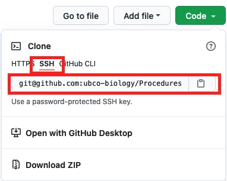

# Git Basics

## Cloning a Repository

We'll demo this by getting a local copy of the Procedures and Guidelines repo on our machine.

### Procedures and Guidelines Repo

In your favourite browser, head to https://github.com/ubco-biology and select the repository \'Procedures-and-Guidelines\'. In the upper right corner, select the Code drop down, select SSH and copy the address to your clipboard.



Open Terminal or Git Bash and move to where ever you\'d like to keep this content on your local machine. Myself, I keep a Git folder in my user space, organized by project:

```
cd ~/Git/ubco-biology
```

Now we\'ll clone. Use the following formula `git clone address`

```
git clone git@github.com:ubco-biology/Procedures-and-Guidelines.git
```

You can double check all is good:

```
ls
cd Procedures-and-Guidelines
ls
```

And you should see that you have a local folder, and going into that, that you have all the files associated with the project.

## Keeping up to Date

You definitely want to routinely ensure that your local repository is up to date with what\'s in the cloud at GitHub. This will help to minimize merge conflicts. We do this with `git pull`.

## Committing Your Changes

In git, after we\'ve made edits, we first stage our changes with `git add`, we then commit our changes with `git commit` and finally we send our local changes to the server (ie GitHub) with `git push`.

**NOTE** Refer to the Suggested Workflow documentation for how to handle this in more detail.

### Git Add

If you've a single file, you can add it with

```
git add fileName
```

If you have many files that you\'ve updated, you can leverage wild cards and do something like

```
git add *
```

to add everything. If you\'ve rebuilt the `docs` directory, this is probably the easy way to go.

### Git Commit

After staging, we `commit`. A `commit` is always accompanied by a commit message, something that indicates what we changed. The fact that this is the case, should give you a sense of how often you should <code>add</code> and <code>commit</code> things. If you're in Procedures and Guidelines directory, and you're working on the File Naming content in the morning and then you move to the Figures and Tables content in the afternoon, you should probably <code>add</code> and <code>commit</code> between each of these, to keep you commit message simple. Messages are added with a `-m` flag.

```
git commit -m "Updated FileNaming.md"
```

### Git Push

After committing our changes, we want to sync our local content with the server. We do this with `push`.

Our repositories are set up with the convention that you are working on a set of files on a branch called `main` and your server is accessed through `remote`. The general formula here is that we want to `push` to `origin` our branch `main`. We do that with the following

```
git push origin main
```

## Getting a Status Update

Git will give us a report about what has and what has not changed with `status`. There\'s no harm in checking in on things regularly.

```
git status
```
